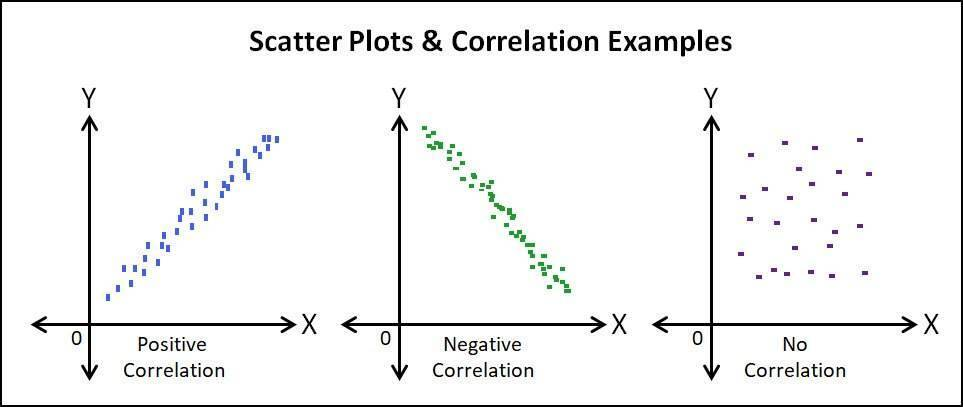
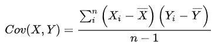
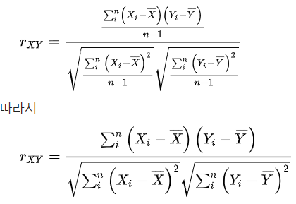
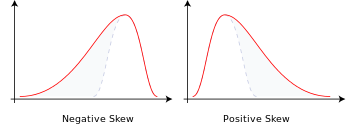
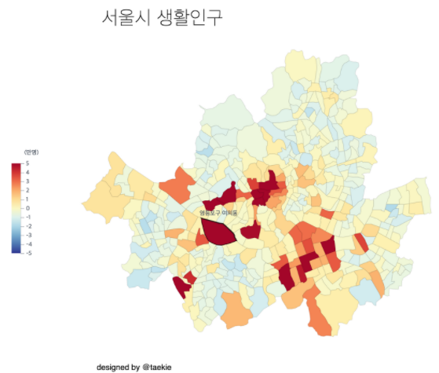
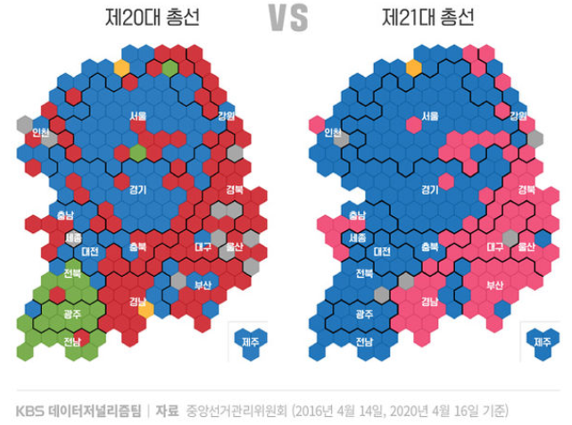
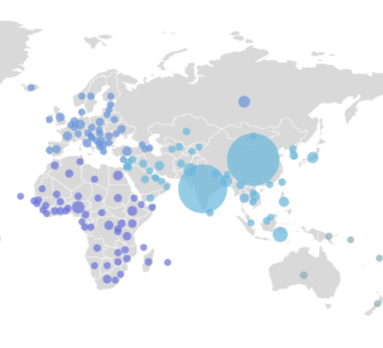

# II. 빅데이터 탐색

## 02. 데이터 탐색
---
### 2.1 데이터 탐색 기초

|-|KeyWord|
|:--:|--|
|데이터 탐색|데이터 탐색, EDA, Four R's, 저항성, 잔차해석, 자료재표현, 현시성|
|상관관계 분석|상관관계 분석, 산점도, 공분산(경향), 상관계수(방향+강도)|
|기초 통계량|중심경향성, 산포도, 분포, 왜도, 첨도|
|시각화|히스토그램, 막대형 그래프, 박스 플롯, 산점도|

============================================================
#### 1) 데이터 탐색 개요
##### (1) 데이터 탐색의 개념
 - 데이터 분석 전 그래프나 통계적인 방법으로 다양한 각도에서 데이터 특징을 파악하고, 직관적으로 보는 분석방법
 - 데이터 탐색 도구: 도표/ 그래프/ 요약통계

##### (2) 탐색적 데이터 분석(EDA; Exploratory Data Analysis)
 - EDA의 4가지 주제: 저항성 / 잔차해석 / 자료재표현 / 현시성
 - Four R's: Resistance / Residuals / Re-expression / Representation
 - 저항성
   - 부분적 변동에 민감하지 않음
   - 오류점, 이상값의 영향을 적게 받음
   - (ex) 평균보다 저항성이 큰 중위수를 대푯값으로 선호함
 - 잔차 해석
   - 주 경향에서 벗어난 특징 파악
   - 잔차: 관찰 값들이 주 경향으로부터 벗어난 정도
   - 보통과 다른 특징 / 왜 존재하는지 탐색
 - 자료 재표현
   - 원래 변수를 적당한 척도로 바꾸는 것
   - 데이터 분석 및 해석을 단순화
   - 로그 / 제곱근 / 역수 변환
   - 데이터 구조파악에 도움(분포의 대칭성 / 선형성 / 안정성 등)
 - 현시성
   - 분석 결과를 쉽게 이해할 수 있도록 시각화
   - 현시성 = 데이터 시각화, Display, Visualization
   - 숨어있는 정보 시각화 -> 자료 구조를 효율적으로 파악

##### (3) 개별 변수(데이터) 탐색 방법
 - 범주형(질적) 데이터: 명목척도 / 순위척도
   - 분포 특성을 중심성 / 변동성 측면에서 파악
   - 빈도수 / 최빈값 / 비율 / 백분율 등
   - 막대 그래프 활용
 - 수치형(양적) 데이터: 등간척도 / 비율척도
   - 분포 특성을 중심성 / 변동성 / 정규성 측면에서 파악
   - 평균 / 분산 / 표준편차 / 첨도 / 왜도 등
   - 박스플롯 / 히스토그램 활용

##### (4) 다차원 데이터(데이터 조합) 탐색 방법
 - 범주-범주: 연관성을 분석
   - 빈도수 / 비율 활용 -> 교차빈도 / 비율 / 백분율 분석 등
   - 막대 그래프
 - 수치-수치: 상관성 / 추세성을 분석
   - 산점도 / 기울기 활용
   - 공분산: 방향성 파악
   - 피어슨 상관계수: 방향/강도 파악
 - 범주-수치: 그룹간 비교
   - 각 그룹별 수치형 변수의 기술통계량을 비교
   - 박스 플롯

============================================================
#### 2) 상관관계 분석
##### (1) 상관관계 분석(Correlation Analysis)
 - 2개 이상의 변수 사이의 상호연관성의 존재 여부와 연관성의 강도를 측정하는 분석 방법

##### (2) 변수 사이의 상관관계 종류
 - 양의 상관관계(+): 한 변수↑ 다른 변수↑
 - 음의 상관관계(-): 한 변수↑ 다른 변수↓
 - 상관관계 없음(0): 무관하게 변화

##### (3) 상관관계의 표현방법
 - 산점도 / 공분산(경향) / 상관계수(방향+강도)
 - 산점도(Scatter Plot) 예시  

 - 공분산(Covariance)
   - 2개 변수간 상관 정도 / 경향
   - 0보다 큰지 작은지
     - Cov > 0: 상승 경향
     - Cov < 0: 하강 경향
   - 단위에 따라 값의 크기가 달라짐 → 강도 나타낼 수 없음
   - 공분산 공식  

 - 상관계수(Correlation Coefficient)
    - 2개 변수간 방향성 / 강도
    - 범위: -1 <= r <= 1
    - 1에 가까울수록 강한 양의 상관관계 / -1에 가까울수록 강한 음의 상관관계
    - 피어슨 상관계수(Pearson Correlation Coefficient) 공식  
        

##### (4) 상관관계 분석의 종류
 - 변수의 개수에 따라 구분: 단순 상관 분석 / 다중 상관 분석
   - 단순 상관 분석: 2개 변수 사이의 상관성
   - 다중 상관 분석: 3개 이상 변수 사이의 상관성
 - 변수의 속성에 따라 구분: 수치적 / 명목적 / 순서적 데이터
   - 수치적 데이터: 피어슨 상관계수
     - 전제조건: 두 변수의 분산이 동일
     - (ex) 키와 몸무게 / 수입과 지출
   - 명목적 데이터: 카이제곱 검정(교차분석)
     - 분류의 의미만 가지므로, 상관계수 계산은 의미 없음
     - (ex) 지역 / 종교 / 성별
   - 순서적 데이터: 스피어만 순위상관계수
     - 한 변수를 단조 증가함수로 변환하여 다른 변수를 나타낼 수 있는 정도
     - 두 변수간의 비선형적인 관계도 나타낼 수 있음
     - (ex) 성적 순위 / 만족도

============================================================
#### 3) 기초 통계량 추출 및 이해
##### (1) 기초통계량 구분
 - 중심 경향성 / 산포도 / 분포  

 |중심 경향성|산포도|분포|
 |:--:|:--:|:--:|
 |평균 중위수 최빈값|범위 분산 표준편차 변동계수 사분위 수 범위|왜도 첨도|

##### (2) 중심 경향성의 통계량
 - 평균 / 중위수 / 최빈값
 - 평균(Mean)
   - (변수 값들의 합) / (변수 개수)
   - 이상값에 의한 변동 변화 심함
 - 중위수(Median)
   - 크기 순서로 오름차순 정렬 -> 중앙에 위치한 값
   - 변수 홀수 개: (n+1)/2 번째
   - 변수 짝수 개: n/2 번째와 (n+2)/2 번째의 평균
 - 최빈값(Mode): 가장 많이 관측되는 값

##### (3) 산포도(흩어진 정도)의 통계량
 - 범위 / 분산 / 표준편차 / 변동계수 / 사분위 수 범위
 - 범위(Range): 최댓값(Max) - 최솟값(Min)
 - 분산(Variance)
   - 평균으로부터 흩어진 정도
   - 편차들의 제곱 합
   - 모분산은 N으로 / 표본분산은 (n-1)으로 나눔
 - 표준편차(Standard Deviation): 분산의 양의 제곱근
 - 변동계수(CV; Coefficient of Variation)
   - 측정 단위가 다른 자료의 흩어진 정도를 상대적으로 비교함
   - (표준편차) / (표본평균)
   - 값이 클수록 상대적인 차이가 큼
   - 변동계수 = 상대 표준편차
 - 사분위 수 범위(IQR; InterQuartile Range)
   - 자료들의 중간 50%에 포함되는 자료의 산포도
   - IQR = Q₃ - Q₁ 
   - Q₁ = 중위수를 기준으로 좌측의 중위수
   - Q₃ = 중위수를 기준으로 우측의 중위수

##### (4) 분포(치우친/뾰족한 정도)의 통계량
 - 왜도 / 첨도
 - 왜도(Skewness): 분포가 좌/우로 치우친 정도
 
     
     
   - 왼쪽 편포: 왜도 < 0 (Negative Skew)
     - (그림에서 분포 가운데 있는 회색점선이 왼쪽으로 치우쳐서 왼쪽편포임)
     - 왼쪽 꼬리가 긴 분포: Mean < Median < Mode
   - 오른쪽 편포: 왜도 > 0 (Positive Skew)
     - (회색 점선이 오른쪽으로 치우쳐서 오른쪽 편포임)
     - 오른쪽 꼬리가 긴 분포: Mode < Median < Mean
   - 정규 분포
     - 왜도 = 0
     - 평균 중심으로 대칭인 분포: Mode = Mean = Median

 - 첨도 (Kurtosis): 정규분포곡선으로부터 위/아래로 뾰족한 정도
   - 첨도 < 0: 납작
   - 첨도 > 0: 뾰족
   - 첨도 = 0: 정규분포

============================================================
#### 4) 시각적 데이터 탐색
##### (1) 시각화 도구
 - 히스토그램 / 막대형 그래프 / 박스 플롯 / 산점도

##### (2) 히스토그램(Histogram)
 - 자료 분포 형태를 직사각형 형태로 시각화
 - 가로축: 수치형 데이터
 - 막대: 붙어 있음 / 넓이 일정

##### (3) 막대형 그래프(Barplot)
 - 여러 항목들의 많고 적음을 비교함
 - 항목별 수향을 막대 길이로 표현
 - 가로축: 수치형 데이터 아니어도 됨
 - 막대: 떨어져 있음 / 넓이 일정X

##### (4) 박스 플롯(Boxplot)
 - 집합의 범위 / 중앙값 / 이상값을 빠르게 확인할 수 있는 시각화 기법
 - 박스 플롯 = 상자 그림 = 상자 수염 그림
 - Q1 = 제 1사분위 = 중앙값 기준으로 하위 50% 중에서 중앙값 = 전체 데이터 중 하위 25%에 해당하는 값  
 Q2 = 제 2사분위 = 중위수 = 정 가운데 순위에 해당하는 값  
 Q3 = 제 3사분위 = 중앙값 기준으로 상위 50% 중에서 중앙값 = 전제 데이터 중 상위 25%에 해당하는 값
 - 하위 경계 = Q₁ - 1.5 ⨉ IQR  
 상위 경계 = Q₃ + 1.5 ⨉ IQR
 - 이상값 = 수염보다 바깥쪽에 있는 데이터

##### (5) 산점도(Scatter Plot)
 - 좌표평면 상에 각 관찰점을 표시하는 시각화 기법
 - 2개의 연속형 변수 간의 관계를 볼 수 있음

---
### 2.2 고급 데이터 탐색

|KeyWord|시공간 데이터, 다변량 데이터, 비정형 데이터|
|:--:|--|

============================================================
#### 1) 시공간 데이터 탐색
 
##### (1) 시공간 데이터(Spatio-Temporal Data)
 - 공간적 객체에 시간적 개념이 추가되어 시간에 따라, 위치나 형상이 변하는 데이터
 - 시공간 데이터 특징: 거리속성/ 시간속성
   - 이산적 변화: 수집 주기 일정X → 시간 변화에 따라 데이터 추가됨
   - 연속적 변화: 수집 주기 일정O → 함수로 연속적인 변화를 표현함
 - 시공간 데이터 타입
   - 포인트: 하나의 노드
   - 라인: 두개의 노드 + 하나의 세그먼트
   - 폴리곤: n개의 노드 + n개의 세그먼트
   - 폴리라인: n개의 노드 + n-1개의 세그먼트

##### (2) 시공간 데이터 탐색 절차
 - 주소를 행정구역으로 변환: 문자열 처리함수로 변환(split, find, left, mid)
   - split(문자열, 구분자): 공백/쉼표 등을 기준으로 나눔
   - find(찾는 문자, 문자열): 찾는 문자의 인덱스 반환
   - left(문자열, n): 가장 왼쪽부터 n개의 문자열 반환
   - mid(문자열, 시작위치, n): 문자열의 시작위치부터 n개 만큼 문자열 반환
 - 주소를 좌표계로 변환: 위도, 경도로 반환 (지오코딩 서비스)
 - 행정구역, 좌표계를 지도에 표시: 코로플레스 지도 / 카토그램 / 버블플롯맵

|코로플레스 지도 (Choropleth Map)|카토그램 (Cartogram)|버블플롯맵 (Bubble Plot Map)|
|--|--|--|
|- 등치지역도 - 데이터 값 크기에 따라 영역 색칠 - 지역 면적 ≠ 실제 데이터 값 크기|- 변량비례도 - 데이터 값 크기에 따라 면적 왜곡 - 직관적으로 인지 가능|- 위도, 경도 적용 - 좌표를 원으로 - 원 크기, 색깔 반영|
||||

============================================================
#### 2) 다변량 데이터 탐색
##### (1) 다변량 데이터
 - 변량(Variance): 조사대상의 특징/성질을 숫자 or 문자로 나타낸 값
 - 유형: 종속변수(Y) 수에 따라 구분 -> 일변량 / 이변량 / 다변량 데이터
   - 일변량: 각 단위에 대해 1개의 속성만 측정
   - 이변량: 2개의 특성을 측정
   - 다변량: 2개 이상의 특성을 측정

##### (2) 변량 데이터 탐색
 - 일변량 데이터 탐색 방법
   - 기술 통계량: 평균 / 분산 / 표준편차 등
   - 그래프 통계량: 히스토그램 / 상자그림 등
 - 이변량 데이터 탐색 방법: 동시 관측 -> 변수간 관계 밝히기
 - 다변량 데이터 탐색 방법
   - 분석 전에 시각적으로 탐색 -> 산점도 행렬 / 별 그림 / 등고선 그림 등
   - 산점도 행렬: 두 변수간 산점도를 행렬로 -> 변수간 연관성 표현
     - 그림 행렬: 변수 최대 20개 / 가능한 모든 조합
     - 개별 Y대 개별 X행렬: 각 xy조합의 그래프들
   - 별 그림
     - 점: 각 변수에 대응
    - 반경: 각 변숫값에 비례

============================================================
#### 3) 비정형 데이터 탐색
##### (1) 비정형 데이터(Unstructured Data)
 - 구조화 되지 않은 데이터 (이미지 / 영상 / 텍스트)

##### (2) 비정형 데이터의 유형 및 탐색방법
 - 비정형 데이터
   - 텍스트: 정형 데이터로 변환 -> 단어 빈도
     - 탐색방법: 파싱(Parsing) 후 탐색
   - 이미지: 픽셀마다 수치화 -> CNN 등의 딥러닝 기법
     - 탐색방법: 응용소프트웨어 활용
 - 반정형 데이터
   - XML / JSON / HTML
   - 탐색방법: 각 파서를 이용하여 파싱 후 탐색

##### (3) 비정형 데이터 탐색 플랫폼
- HDFS / 맵리듀스 / 주키퍼 / Avro / Hive / Pig / HCatalog
