# II. 빅데이터 탐색

## 03. 통계기법 이해
---
### 3.1 기술 통계

|-|KeyWord|
|:--:|--|
|데이터 요약|기술통계, 기초통계량, 평균, 중위수, 최빈값, 범위, 분산, 표준편차, 평균의 표준오차, 분포(첨도, 왜도), 상관분석, 회귀분석, 선형성, 등분산성, 독립성, 비상관성, 정규성, 분산분석, 성분분석, 판별분석|
|표본 추출|표본 추출|
|확률분포|확률분포, 포아송분포, 베르누이분포, 이항분포, 정규분포, 표준정규분포, T-분포, 카이제곱분포, F-분포|
|표본분포|표본분포|

 - 기술 통계(Descriptive Statistics)
   - 데이터 분석을 목적으로 수집된 데이터를 확률·통계적으로 정리·요약하는 기초적인 통계
   - 기술통계 목적: 분석 초기 단계에 데이터 분포의 특징을 파악하고자 함
   - 기술통계 방법
     - 통계적 수치 계산: 평균 / 분산 / 표준편차
     - 그래프 활용: 막대 그래프 / 파이 그래프
     - 통계적 수치, 그래프 등을 통해 데이터에 대한 전반적인 이해를 도움

============================================================
#### 1) 데이터 요약
##### (1) 기초통계량
 - 평균 / 중위수 / 최빈값 / 범위 / 분산 / 표준편차 / 평균의 표준오차 / 분포(첨도, 왜도)
 - 평균(Mean): (자료를 모두 더한 값) / (자료 개수)
   - 같은 가중치 / 이상값에 민감
   - 모평균: 조사하는 모집단의 평균
   - 표본평균: 모집한의 일부분인 표본(Sample)의 평균
 - 중위수(Median): 오름차순 정렬 -> 중앙에 위치한 데이터값, 특이값 영향X
 - 최빈값(Mode): 빈도수가 가장 높은 데이터값
 - 범위(Range): 최대값(Max) - 최소값(Min)
 - 분산(Variance): 평균으로부터 흩어진 정도
   - 모분산: {(각 데이터값과 평균과의 편차) 제곱의 합} / n
   - 표본분산: {(각 데이터 값과 평균과의 편차) 제곱의 합} /  (n-1)
   - 제곱의 합을 하는 이유: 양의 편차와 음의 편차를 그대로 합하면 0이 되어버림
   - 표본분산은 n-1로 나누는 이유: 모집단에서 표본을 추출하는 단계에서 자유도가 1 빠졌다고 생각하면 쉬움 
     - 자유도(Degree of Freedom): 통계적 추정을 할 때 표본자료 중 모집단에 대한 정보를 주는 독립적인 자료의 수  
      
 - 표준편차(SD; Standard Deviation): 분산의 양의 제곱근
   - 분산과 마찬가지로 표본/모집단의 표준편차  
    
 - 평균의 표준오차(표준오차)(SEM; Standard Error of Mean, SE; Standard Error)
   - 표본평균의 표준편차
   - 표본의 각 평균들이 전체평균으로부터 평균적으로 얼마나 떨어져 있는지
   - 모집단에서 수많은 표본추출 -> 표본들마다 평균 계산 -> 각 평균들에 대한 전체 평균 계산
   - 표준 오차(Standard Error)  
   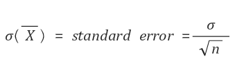  
    

 - 분포(Distribution)
   - 첨도(Kurtosis): 분포의 뾰족한 정도를 설명하는 통계량(분포의 형태)
     - 첨도 = 0: 표준정규분포
     - 첨도 > 0: 뾰족한 분포 형태(첨용)
     - 첨도 < 0: 납작한 분표 형태(평용)
   - 왜도(Skewness): 분포의 기울어진 정도 / 비대칭성을 나타내는 통계량(분포의 대칭성)
     - 왜도 = 0: 좌우대칭
     - 왜도 > 0: 오른쪽으로 긴 꼬리
     - 왜도 < 0: 왼쪽으로 긴 꼬리

##### (2) 상관분석(Correlation Analysis)
 - 2개 이상의 변수간의 연관성의 정도를 측정, 분석하는 방법
 - 연관성의 정도: 한 변수가 다른 변수와 어떤 연관성을 가지고 변화하는가
 - 분석 방법: 단순상관분석(2변수)/ 다중상관분석(3이상)
 - 분석 종류: 수치적 / 명목적 / 순서적 데이터 변수

|수치적 데이터|명목적 데이터|순서적 데이터|
|--|--|--|
|- 두 변수간의 선형적 연관성을  계량적으로 파악 - 피어슨 상관계수 (-1 ≤ r ≤ +1)|- 두 변수간의 연관성을 계량적으로 파악 - 카이제곱 검정|- 순서가 의미있는 두 변수간의 연관성, 상관관계를 검정 - 스피어만 순위상관계수|
|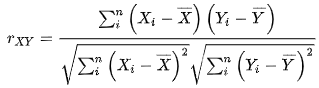|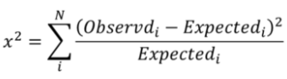|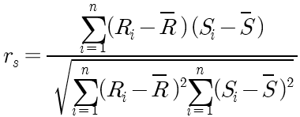|

##### (3) 회귀분석(Regression Analysis)
 - 1개 이상의 독립변수들이 종속변수에 미치는 영향을 추정
 - 종류 : 단순회귀모형 / 다중회귀모형

 |종류|단순 회귀모형|다중 회귀모형|
|:--:|:--:|:--:|
|독립변수|1개 수치형|2개 이상 수치형, 범주형|
|종속변수|1개 수치형|1개 수치형|

 - 적합성평가: 모형에 대한 적합성을 평가
   - 분산분석표 : 회귀식이 통계적으로 유의한지
   - 결정계수 R²: 모형의 설명력 확인
   - 전제조건: 선형성 / 등분산성 / 독립성 / 비상관성 / 정규성 -> 잔차 그래프로 확인
     - 선형성: 독립변수와 종속변수간 선형관계 존재
     - 등분산성: 잔차들의 분산은 같음
     - 독립성: 잔차와 독립변수 값은 독립적(상관X)
     - 비상관성: 잔차들끼리 독립적(상관X)
     - 정규성: 잔차는 정규분포 따름(평균=0, 분산=σ²)
 - 독립변수 선택방법: 전진선택법 / 후진선택법 / 단계적방법(전진+후진)

##### (4) 분산분석(ANOVA; Analysis of Variance)
 - 2개 이상의 집단간 비교
 - 분산분석 특징
   - (집단 내 분산)과 (집단 간 분산)의 비교를 통해 2개 이상의 집단간 비교를 수행
   - 분산을 계산하여 집단 간 통계적인 차이를 판정
   - F-검정 통계량: (집단 내 분산) 대비 (집단 간 분산)이 몇 배 더 큰지 나타내는 값
 - 종류: 일원 / 이원 / 다변량 분산분석 / 공분산 분석
   - 독립변수에 의한 집단간 종속변수의 평균 차이를 비교
   - 공분산 분석: 연속형 외생변수가 종속변수에 미치는 영향을 제거 -> 순수한 집단간 평균 차이를 비교
   
|종류|일원 분산분석 (ANOVA)|이원 분산분석 (Two-way ANOVA)|다변량 분산분석 (MANOVA)|
|:--:|:--:|:--:|:--:|
|독립변수|1개|2개|-|
|종속변수|1개|1개|2개 이상|

##### (5) 주성분 분석(PCA; Principal Component Analysis) 
 - 주성분 변수를 원래 변수의 선형결합으로 추출하는 통계기법
 - 주성분 변수: 원래 변수 정보를 축약한 변수
 - 일부 주성분에 의해, 원래 변수의 변동이 충분히 설명되는지 분석
 - 가장 적은 개수의 주성분으로 분산의 최대량을 설명
   - 원래 변수 P개, 주성분 개수 K개 -> P >> K

##### (6) 판별 분석(Discrimination Analysis)
 - 집단을 구별하는 분석
 - 집단에 대한 정보 -> 집단 구별 가능한 판별규칙/판별함수 생성 -> 새로운 개체는 어떤 집단에 속하는지 판별

============================================================
#### 2) 표본 추출
##### (1) 표본 추출 기법
 - 단순 무작위 / 계통 / 층화 / 군집 추출
 - 단순 무작위 추출: 정해진 규칙없이 표본 추출
 - 계통 추출: 일정한 간격으로 표본 추출
 - 층화 추출: 여러 계층 나눔 -> 계층별로 무작위 추출
   - 계층: 내부 동질 / 외부 이질
   - (ex) 지역별 여론조사
 - 군집 추출: 여러 군집 나눔 -> 일부 군집의 전체 or 일부 추출
   - 군집: 계층과 다르게 성질 고려X

##### (2) 자료 측정(Measurement)
 - 대상의 특정한 속성을 숫자 or 기호로 표시
 - 척도(Scale): 명목척도 / 순서척도 / 구간척도 / 비율척도

|질적 속성|질적 속성|양적 속성|양적 속성|
|:--:|:--:|:--:|:--:|
|명목척도 Nominal Scale|순서척도 Ordinal Scale|구간척도 Interval Scale|비율척도 Ratio Scale|
|분류목적 등호연산 가능(=, ≠)|대소관계 비교연산 가능(>, <)|서열과 의미있는 차이 가짐|구간 척도 + 척도간 비율 승제연산 가능(÷, ×)|
|(ex)이메일 주소/계정/성별|(ex)직급/영화평점/선호도|(ex)온도/지능지수|(ex)질량/개수/길이|

============================================================
#### 3) 확률분포
##### (1) 확률분포(Probability Distribution)
 - 확률분포: 확률변수가 특정한 값을 가질 확률을 나타내는 분포
 - 확률변수: 확률적인 과정에 따라 값이 결정되는 변수

##### (2) 확률분포의 종류
 - 이산확률분포 / 연속확률분포
 - 이산확률분포(Discrete Probability Distribution)
  - 포아송 / 베르누이 / 이항분포
  - 이산확률변수는 하나씩 셀 수 있는 값을 취함(X = 0, 1, 2, 3, ...)

|포아송 분포|베르누이 분포|이항 분포|
|:--:|:--:|:--:|
|발생 횟수|1번 시행|n번 시행|
|주어진 시간, 영역에서어떤 사건의 발생횟수|시행 결과 성공 or 실패|n번 시행/각 시행 확률 = p k번 성공할 확률분포|
|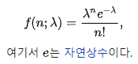|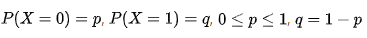|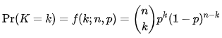|

 - 연속확률분포(Continuous Probability Distribution)
   - 정규분포 / 표준정규분포 / T-분포 / 카이제곱분포 / F-분포
   - 연속확률변수는 실수와 같이 연속적인 값을 취함
   - 카이제곱분포: 표본통계량이 표본분산일 때 표본 분포

|정규분포|표준정규분포 (Z-분포)|T-분포|카이제곱분포|F-분포|
|:--:|:--:|:--:|:--:|:--:|
|N(μ, σ²) 종모양 분포|Z(0, 1) X를 Z로 정규화|정규분포라는 건 알고 모표준편차는 모를때 사용|서로 독립적인 K개의 표준정규 확률변수를 각각 제곱해서 합함|독립적인 카이제곱분포에서 두 확률변수의 비|
|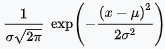|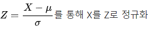|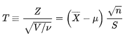|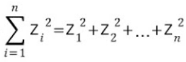|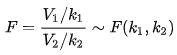|

============================================================
#### 4) 표본 분포
##### (1) 표본 분포(Sampling Distribution)
 - 표본이 가지는 추정량의 확률분포
 - 모집단에서 추출한 크기가 n개로 일정한 표본이 가지는 추정량의 확률분포
 - 표본의 특성을 보여주는 통계량(Statistics)에 의해모집단의 특성을 보여주는 모수(Parameter)를 추론
 - 모집단과 표본의 관계
 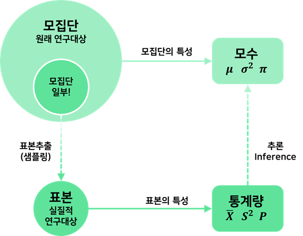

##### (2) 표본 분포 용어
 - 모집단 / 모수 / 통계량 / 추정량 / 표준편차 / 표준오차
 - 모집단(Population): 분석 대상 집단 전체
 - 모수(Parameter): 모집단을 특성을 나타내는 대표값
 - 통계량(Statistics): 표본에서 얻은 평균, 표준오차와 같은 값
   - 통계량을 통해 모수를 추정함
   - 표본에 따라 달라지므로 통계량은 확률변수임
 - 추정량(Estimator): 모수 추정을 위해 구한 통계량
 - 표준편차(Standard Deviation): 자료의 변동 정도
 - 표준오차(Standard Error): 통계량의 변동 정도- 평균을 낸 값들의 표준편차

##### (3) 표본 조사 용어
 - 표본오차 / 비표본오차 / 표본편의
 - 표본(Sample): 모집단의 특성을 추정하기 위해, 조사하는 모집단의 일부분
 - 표본 조사: 모집단 일부분을 조사하는 행위
 - 표본오차(Sampling Error): 모집단을 대표할 수 있는 것들이 추출되지 못해서 발생하는 오차
 - 비표본오차(Non-Sampling Error): 표본오차를 제외한 모든 오차(조사과정 부주의, 실수, 알 수 없는 원인 등)
 - 표본편의(Sampling Bias): 표본추출 방법에서 생기는 오차 (모수를 작게 or 크게 추정)
   - 확률화(Randomization): 모집단으로부터 편의되지 않은 표본을 추출하는 절차
   - 확률화 절차로 추출한 확률표본으로, 표본편의를 최소화할 수 있음

##### (4) 표본 분포와 관련된 법칙
 - 큰 수의 법칙 / 중심 극한 정리
 - 큰 수의 법칙(Law Large Number)
   - 표본 개수 n이 커질수록 표본평균 분산이 0에 가까워짐
   - 즉, 데이터 퍼짐이 적어짐 -> 표본평균과 모평균이 비슷해짐
 - 중심 극한 정리(Central Limit Theorem)
   - 표본 개수 n이 커질수록 모집단 분포와 상관없이 표본분포가 정규분포에 근사

##### (5) 표본 분포의 유형
 - Z-분포 / T-분포 / 카이제곱 분포 / F-분포

---
### 3.2 추론 통계

|-|KeyWord|
|:--:|--|
|점 추정|추론통계, 점추정, 불편성, 효율성, 일치성, 충족성|
|구간 추정|구간추정, 신뢰수준, 신뢰구간|
|가설검정|가설검정, 귀무가설, 대립가설, 제 1종 오류, 제 2종 오류, 검정통계량, p-value|

============================================================
#### 1) 점 추정
##### (1) 점 추정(Point Estimation)
 - 표본의 정보로부터 모집단의 모수를 하나의 값으로 추정하는 기법
- 점 추정 조건: 불편성 / 효율성 / 일치성 / 충족성
  - 불편성(Unbiasedness): 모든 표본의 추정량들의 기댓값 = 모수
  - 효율성(Efficiency): 추정량의 분산이 작을수록 좋음
  - 일치성(Consistency): 표본 크기 아주 커짐 -> 추정량 ≈ 모수
  - 충족성(Sufficient): 추정량은 모수에 대한 모든 정보를 제공

##### (2) 점 추정에 사용되는 통계
 - 표본평균 / 표본분산 / 중위수 / 최빈값
 - 표본평균(Sample Mean): 모평균의 추정량 / 확률표본의 평균값
 - 표본분산(Sample Variance): 모분산의 추정량

============================================================
#### 2) 구간 추정
##### (1) 구간 추정(Interval Estimation)
 - 범위로 모수를 추정
 - 추정값에 대한 신뢰도를 제시하면서, 범위로 모수를 추정하는 방법
 - 추정량의 분포에 대한 전제와 구간 안에 모수가 있을 신뢰수준이 주어져야 함
 - 구간 추정 용어: 신뢰수준 / 신뢰구간
   - 95% 신뢰수준에서 모집단의 분포를 알고 있는 경우 -> P(-1.96 ≤ Z ≤ 1.96) = 0.95, α = 0.05
   - 신뢰 수준과 신뢰 구간  
   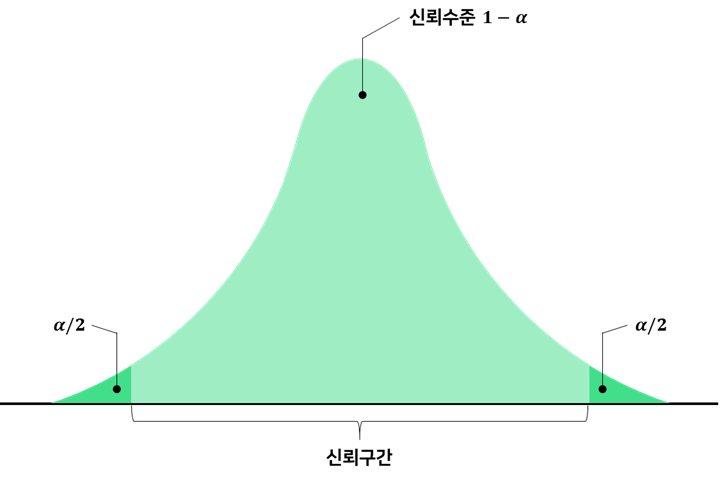
     
   |신뢰수준|- 구간에 모수가 포함될 확률 - 어떠한 값이 알맞은 추정값 이라고 믿을 수 있는 정도|- α = 오차수준, 유의수준 - 100×(1-α) % = 신뢰수준|
   |:--:|--|--|
   |**신뢰구간**|**- 신뢰수준 기준으로 추정 - 통계적으로 유의미한 모수가 어느 범위 안에  있는지를 확률적으로  보여주는 방법**|**{표본평균 - (z × SE)} ~ {표본평균 + (z × SE)}**|

============================================================
#### 3) 가설검정
##### (1) 가설(Hypothesis)
 - 모수에 대한 가정 or 잠정적인 결론
 - 귀무가설(H₀): 기존과 차이 없음 / 현재까지와 변화 없음
 - 대립가설(H₁): 입증하고자 하는 가설 / 기존과 다른 내용
   - 표본을 통해 확실한 근거를 가지고 입증하고자 함
   - 대립가설 = 연구가설
 - 모집단 평균에 대한 가설검정
 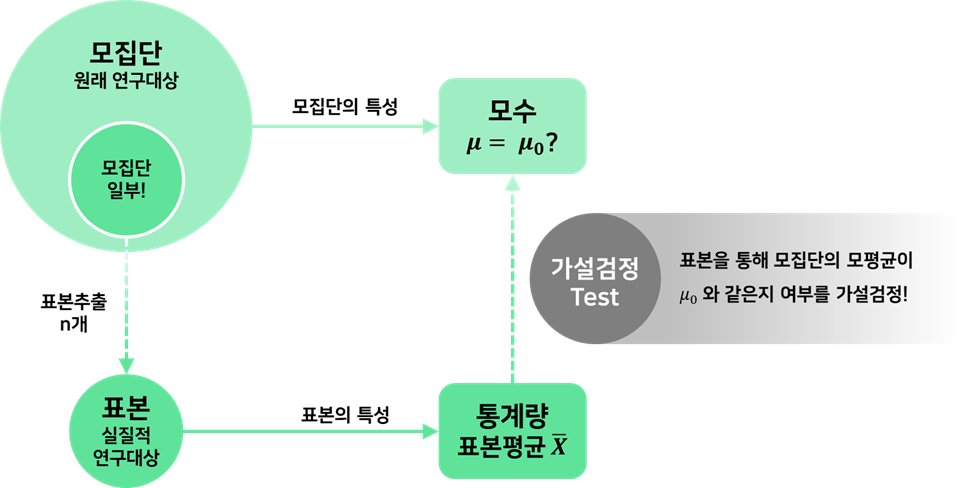

##### (2) 가설검정(Statistical Hypothesis Test)
 - 대립가설을 채택할 수 있는지 평가하는 과정
 - 모집단에 대한 통계적 가설(대립가설)을 세우고 추출한 표본에서 얻은 정보를 이용하여 통계적 가설의 진위를 판단하는 과정
 - p-value = 유의확률
   - H₀이 맞다고 가정할 때 얻은 결과보다 극단적인 결과가 실제로 관측될 확률
   - 귀무가설이 참이라는 전제 하에 표본에서 실제로 관측된 통계치와 같거나, 더 극단적인 통계치가 관측될 확률
   - p-value < α : H₀ 기각, H₁ 채택
   - p-value > α : H₀ 채택 (H₀ 기각할 수 없음)
 - 가설검정 절차: 가설 설정 -> 유의수준 설정 -> 검정방법 설정 -> p-value 산출 -> p-value와 유의수준 비교
 - 가설검정 방법: 양측검정 / 단측검정
   - 양측검정: 모수가 특정값과 통계적으로 같은지 여부
     - H₀ : θ = θ₀
   - 단측검정: 모수가 특정값보다 통계적으로 큰지/작은지 여부
     - H₀ : θ ≥ θ₀- H₀ : θ ≤ θ₀

##### (3) 가설검정의 오류
 - 가설을 검증할 때- 모집단이 아닌, 추출된 표본을 기반으로 모집단에 대한 결론을 내림  
 -> 통계적인 오류 발생 가능성이 항상 존재
 - 제 1종 오류 / 제 2종 오류
   - 제 1종 오류: 귀무가설이 참인데, 기각하게 되는 오류 (H₀ T → F)
   - 제 2종 오류: 귀무가설이 거짓인데, 채택하게 되는 오류 (H₀ F → T)
 - 기각역: 대립가설이 맞을 때 그것을 받아들이는 확률  
 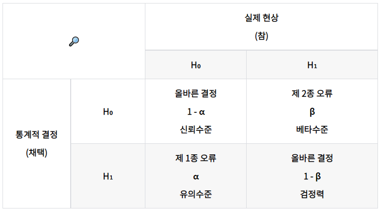

##### (4) 검정 통계량
 - 모수를 추론하기 위해 사용하는 표본의 통계량

##### (5) p-value
 - 제 1종 오류를 범할 확률
 - 검정 통계량에 근거하여, 귀무가설이 참인데 기각하게 될 확률
 - 귀무가설을 가정하였을 때, 표본 이상으로 극단적인 결과를 얻을 확률
 - 귀무가설을 지지하는 방향으로 검정 통계량이 나올 확률
 - 제 1종 오류에서 연구자가 내린 판정이 잘못되었을 실제 확률
 - 귀무가설이 참이라는 가정에 따라 주어진 표본 데이터를 희소 또는 극한값으로 얻을 확률값
 - 귀무가설이 참이라는 가정 하에서, 연구자가 얻은 검정통계량보다 크거나 같은 값을 얻을 수 있는 확률  
 - 검정통계량와 p-value의 관계  
 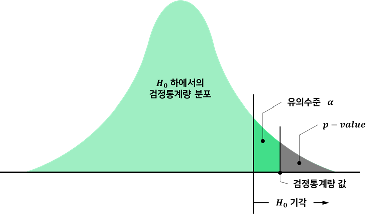
