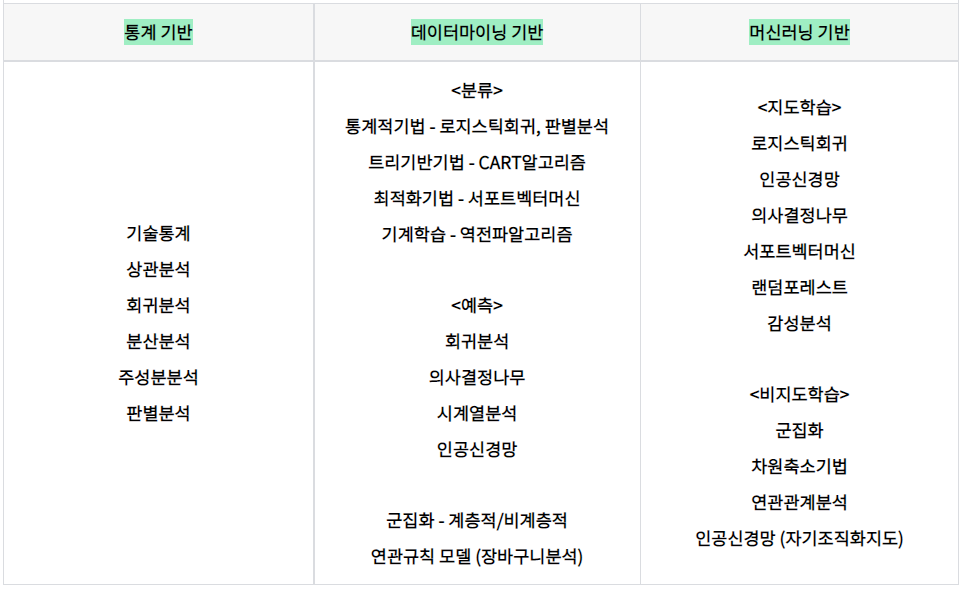
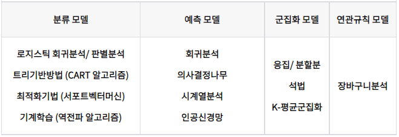
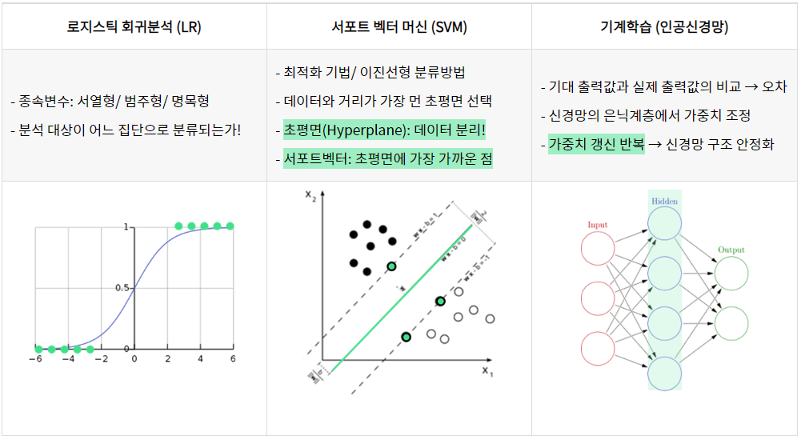
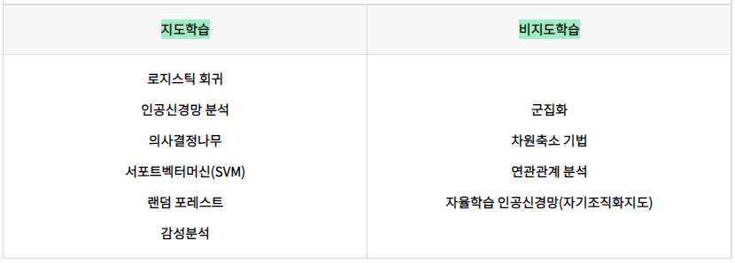
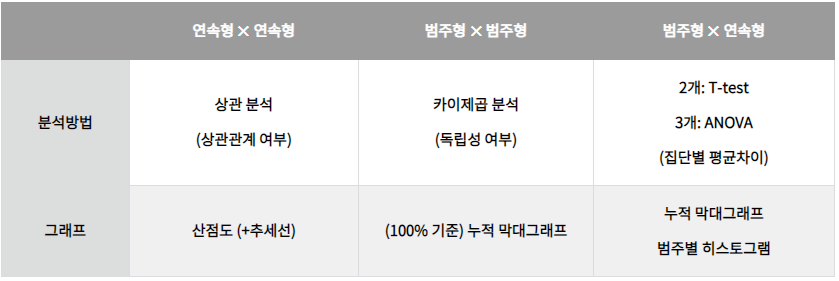
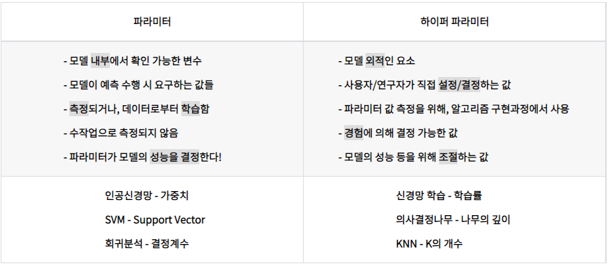
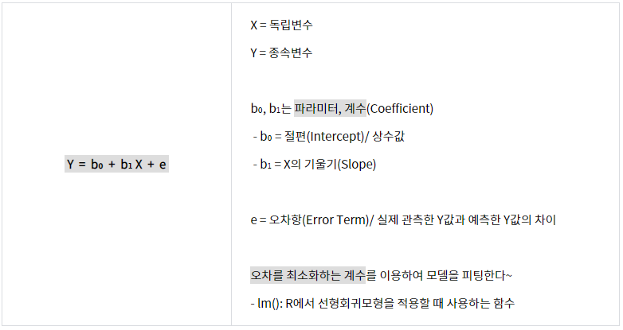
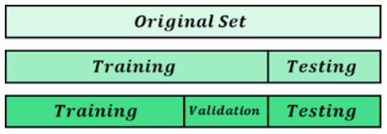

# III. 빅데이터 모델링

## 01. 분석 모형 설계
---
### 1.1 분석 절차 수립

|-|KeyWord|
|:--:|--|
|분석 모형 선정|분석모형, 통계기반, 기술통계, 상관분석, 회귀분석, 분산분석, 주성분분석, 판별분석, 데이터마이닝, 분류, 예측, 군집화, 연관규칙, 머신러닝, 지도학습, 비지도학습|
|분석 모형 정의|파라미터, 하이퍼파라미터|
|분석 모형 구축 절차|모델링, 비즈니스영향도평가|

============================================================
#### 1) 분석 모형 선정
 - 분석 목적 부합 & 데이터 변수 고려 -> 분석 모형 선정
 - 모형(모델): 객체/시스템/개념에 대한 구조나 작업을 보여주기 위한 패턴/계획/설명
 - 탐색적 데이터 분석(EDA): 현상에서 패턴 발견
 - 통계적 추론: 현상에서 결론 도출
 - 기계학습: 현상을 예측
 - 빅데이터 분석 모형
 

##### (1) 통계기반 분석 모형 선정
 - 기술통계 / 상관분석 / 회귀분석 / 분산분석 / 주성분분석 / 판별분석
 - 통계분석
   - 불확실한 상황에서 객관적인 의사결정을 수행하기 위해 데이터를 수집, 처리, 분류, 분석, 해석하는 일련의 체계
 - 기술통계(Descriptive Statistics)
   - 분석 초기에 데이터를 확률/통계적으로 정리/요약하는 기초적인 통계
   - 통계적 수치: 평균/분산/표준편차/왜도/첨도/빈도 등
   - 그래프 활용: 막대그래프 / 파이그래프 등
 - 상관분석(Correlation Analysis)
   - 2개 이상의 변수간 상호연관성의 정도를 측정
   - 단순 상관분석: 2개 변수 사이의 연관관계
   - 다중 상관분석: 3개 이상의 변수 사이의 연관관계
   - 변수간 상관분석: 수치적 / 명목적 / 순서적 데이터 변수간 분석
 - 회귀분석(Regression Analysis)
   - 1개 이상의 독립변수가 종속변수에 미치는 영향을 추정
   - 단순 회귀: 독립변수 1개 / 직선관계
   - 다중 회귀: 독립변수 2개 이상 / 선형관계
   - 다항 회귀: (독립변수 1개/ 2차함수 이상) or (독립변수 2개/ 1차함수 이상)
   - 곡선 회귀: 독립변수 1개 / 곡선관계
   - 로지스틱 회귀: 종속변수 범주형 (단순/다중/다항)
   - 비선형 회귀: 선형관계X
 - 분산분석(ANOVA)
   - 2개 이상의 집단간 비교(분산 비교)
   - 일원 분산분석: 독립변수 1개 / 종속변수 1개
   - 이원 분산분석: 독립변수 2개 / 종속변수 1개
   - 다변량 분석분석: 종속변수 2개 이상
 - 주성분분석(PCA)
   - 주성분 변수를 원래 변수들의 선형결합으로 추출하는 통계기법
   - 일부 주성분에 의해 원래 변수의 변동이 충분히 설명되는지
 - 판별분석(Discriminant Analysis)
   - 집단을 구별할 수 있는 판별규칙/함수 -> 새로운 개체가 어떤 집단인지 탐색

##### (2) 데이터마이닝 기반 분석 모형 선정
 - 분류 / 예측 / 군집화 / 연관규칙
 - 데이터마이닝(Data Mining)
   - 대용량 데이터로부터- 데이터 내의 패턴/관계/규칙 등을 탐색하고 통계적인 기법으로 모델화하여 유용한 정보/지식을 추출
 - 기술(Description)
   - 사람/상품에 대한 이해를 높이기 위해 데이터가 가진 특징을 나타내고 설명에 대한 답을 제공
 - 데이터 마이닝 기반 분석 모형  
 

 - 분류모델(Classification Model)
   - 로지스틱 회귀분석 / 판별분석 / 트리기반(CART) / 서포트벡터머신 / 기계학습(인공신경망)
   - 분류: 범주/그룹을 예측하는 것(범주형 or 이산형 변수)
   - 트리기반: 의사결정규칙에 따라서, 집단을 몇 개의 소집단으로 분류
   - CART 알고리즘: 독립변수 이분화 반복 -> 이진트리 형태 형성 -> 분류 & 예측
   - 기계학습: 경험적인 데이터로부터 스스로 성능을 향상 -> 인간의 학습과 같은 능력을 컴퓨터에서 실현하고자 함
   - 역전파 알고리즘(Backpropagation): 출력값이 원하는 출력과 다를 때, 가중치 갱신으로 오차 최소화를 위한 반복 수행 -> 오차를 출력계층에서 입력계층으로 역방향으로 반영  
   
 

 - 예측모델(Prediction Model)
   - 과거 데이터로부터 특성 분석 -> 새로운(다른) 데이터의 결과값을 예측
   - 회귀분석 / 의사결정나무 / 시계열분석 / 인공신경망
   - 회귀분석(Regression): 2개의 연속형 변수 사이의 모형 생성 -> 적합도 측정
   - 의사결정나무(Decision Tree): 의사결정규칙을 트리구조로 도표화
     - 용도: 분류 및 예측 모형 & 변수모형 분석 전 이상값 검색
   - 시계열 분석(Time Series Analysis): 시계열로 관측되는 자료 분석 -> 미래 예측
   - 인공신경망(ANN): 뉴런이 전기신호를 전달하는 모습을 모방한 예측모델

 - 군집화모델(Clustering Model)
   - 계층적(응집/분할), 비계층적(K-Means)
   - 계층적방법: 군집 수 지정X -> 단계적 군집결과 산출
     - 응집분석법(객체를 합침), 분할분석법(전체에서 분리)
   - 비 계층정방법: 군집 수 지정O -> 객체를 한 군집으로 배정
     - K-평균 군집화: K개 군집의 중심좌표를 업데이트
 - 연관규칙 모델(Association Rule Model)
   - 데이터에 숨어있으면서, 동시에 발생하는 사건/항목 간 규칙을 수치화
   - 연관규칙 분석 = 연관규칙 학습 = 연관성 분석 = 장바구니 분석
   - 장바구니 분석: 상품 배열/카탈로그/교차판매 등에 적용
   - 항목들 간의 (조건-결과) 식으로 표현되는 유용한 패턴을 발견

##### (3) 머신러닝 기반 분석 모형 선정
 - 분석기법: 목적변수(반응변수) 존재 여부 등에 따라서 지도학습/비지도학습/강화학습/준지도학습
 - 머신러닝 기반 분석 모형(지도학습/비지도학습)  
 

 - 지도학습(Supervised Learning)
   - 정답 레이블(Lable)이 포함된 데이터
   - 목적
     - 설명변수와 목적변수 간 관계성 표현
    - 인식/분류/진단/예측 등의 문제해결
   - 랜덤 포레스트(Random Forest)
     - 의사결정나무의 분산이 크다는 단점 보안 -> 약한 학습기들을 선형 결합
   - 감성분석(Sentiment Analysis)
     - 어떤 주제에 대한 주관적인 인상/감정/태도/의견들을 텍스트로부터 추출
 - 비지도학습(Unsupervised Learning)
   - 정답 레이블이 없는 데이터
   - 목적
    - 예측보다, 현상 설명/특징 도출/패턴 도출 문제
    - 사전정보가 없는 상태에서, 유용한 정보와 패턴을 탐색적으로 발견하고자 함
   - 자기 조직화 지도(SOM)
     - 비지도 학습기반 클러스터링 기법
     - 차원축소와 군집화 동시 수행 -> 고차원 데이터를 저차원으로 변환

##### (4) 변수에 따른 분석기법 선정
 - 변수의 개수에 따른 분석기법
   - 단일변수/이변수/다변수 분석
   - 단일변수 분석: 변수 1개 -> 기술통계 확인
     - 연속형: 히스토그램, 박스플롯
     - 범주형: 막대그래프
   - 다변수 분석: 변수 3개 이상의 관계 -> 시각화/분석
     - 범주형 1개 이상 포함: 변수를 범주별로 쪼갬
     - 연속형 3개 이상 포함: 연속형을 범주형으로 변환
   - 이변수 분석: 변수 2개 관계 -> 분석  

 

 - 데이터 유형에 따른 분석기법
   - 독립변수 & 종속변수 주어진 경우: 주어진 독립변수에 대한 종속변수 값을 예측/ 분류하는 분석 모델 개발  
   
 

##### (5) 분석기법 선정시 고려사항
 - 목적 / 데이터 해석가능 여부 / 단일 or 앙상블 선택

##### (6) 분석모형 활용사례
 - 연관규칙 학습(장바구니 분석)
   - 콜라를 구매하는 소비자가 사이다를 더 많이 구매하는가?
   - 피자를 주문한 고객은 어떤 음료를 많이 주문하는가?
 - 분류 분석
   - 문서 분류 / 조직 그룹핑
   - 온라인 수강생들을 특성에 따라 분류
 - 유전자 알고리즘: 점진적 진화 -> 최적화
   - 응급 처치 프로세스를 어떻게 배치하는 것이 가장 효율적인가?
 - 기계 학습: 알려진 특성을 훈련 / 학습 / 예측
   - 회원의 기존 시청기록을 바탕으로, 어떤 영상을 가장 보고싶어 할지 예측
 - 회귀 분석: 변수간 인과관계
   - 차주의 나이가 차량 유형에 어떤 영향을 미치는가?
 - 감성 분석: 특정 주제에 대해 말한/서술한 사람의 감정을 분석
   - 새로운 제품/서비스에 대한 소비자들의 평가는 어떠한가?
 - 소셜 네트워크 분석(SNA)
   - 특정인과 다른사람의 관계가 몇 촌인가?
   - 영향력 있는 사람은 누구인가?
   - 고객들 간 관계망의 구성은 어떠한가?

============================================================
#### 2) 분석 모형 정의
##### (1) 분석 모형 정의
 - 분석 모형을 선정하고 모형에 적합한 변수를 선택하여 모형의 사양(Specification)을 작성
 - 파라미터(Parameter): 모델 내부 / 학습된 값
 - 하이퍼 파라미터(Hyper-parameter): 모델 외부 / 결정하는 값  

##### (2) 분석 모형 정의 고려사항
 - 과소적합 / 과대적합 / 모형선택오류 / 변수누락 / 부적합변수생성 / 동시편향
 - 모델 너무 간단 -> 과소적합(Under-fitting): 학습이 부족하여 실제 성능이 떨어짐
 - 모델 너무 복잡 -> 과대적합(Over-fitting): 지나친 차수 증가로 실제 데이터에서 성능 떨어짐
 - 부적합 모형 현상
   - 모형 선택 오류: 적합하지 않은 모형
   - 변수 누락: 모델 생성 시 관계있는 변수를 누락
   - 부적합 변수 생성: 관련 없는 변수를 포함 -> 편향X, 과대적합O
   - 동시 편향: 종속변수가 연립방정식의 일부인 경우

##### (3) 분석 모형 정의 사례

============================================================
#### 3) 분석 모형 구축 절차
 - 분석 모형 구축 절차: 요건 정의 -> 모델링 -> 검증 및 테스트 -> 적용

##### (1) 요건 정의
 - 분석과제 정의 단계에서 도출된 내용을 구체화
 - 분석요건 도출 / 수행방안 설계 / 요건 확정
 - 분석요건 도출
   - 상세하게 도출 / 분석 / 명세화 -> 적합성 검토
   - 업무 배경 / 주요이슈 / 기대효과 / 제약사항을 사전에 정의
 - 수행방안 설계
    - 간단한 탐색적 분석 -> 가설 수립 -> 분석 가능성 검토/우선순위 부여
    - 설계 산출물: 분석계획서, WBS(Work Breakdown Structure)
 - 요건 확정: 이해관계자와 기획안 공유/확정

##### (2) 모델링
 - 상세 분석기법을 적용하여 모델 개발
 - 모델링 마트 설계 및 구축/탐색적 분석 및 유의변수 도출/모델링/성능평가
 - 모델링 마트 설계 및 구축
   - 분석대상 데이터 구조화 및 적재 -> 모델 마트 구축
   - 분석대상 데이터는 전처리를 통해 변수가 식별된 상태
 - 탐색적 분석 및 유의변수 도출
   - 변수값 분포와 구간 차이 파악 -> 유의미한 변수 파악
   - 정보 부족하면 신속하게 추가변수 개발
 - 모델링
   - 적합한 기법 선택 or 여러 기법 결합하여 적용
   - 통계적 모델링이 아님 -> 지나친 통계적 가설과 유의성 적용X
 - 경우에 따라서 시뮬레이션 + 최적화기법 결합
   - 시뮬레이션: 입력값이 확률분포일 경우 -> 처리량과 대기시간 등의 지표로 평가
   - 최적화: 입력값이 상숫값일 경우 -> 목적 함수 값으로 평가
 - 모델링 성능평가
   - 데이터마이닝에서 성능 판단은 정확도/정밀도/재현율/향상도
   - 모형별 학습용 데이터 집합 구축 -> 분석 모형 조정 -> 모형에 검증용 데이터 적용 -> 결과 비교분석(성능평가)
     - 정확도(Accuracy): 실제 분류 범주를 정확하게 예측한 비율(True를 True라고 예측 + False를 False라고 예측)
     - 정밀도(Precision): True로 예측한 것들 중 실제 True인 비율
     - 재현율(Recall): 실제 True인 것들 중 True로 예측한 비율
     - 향상도(Lift): (항목집합 X가 주어지지 않았을 때의 항목집합 Y의 확률) 대비 (항목집합 X가 주어졌을 때 항목집합 Y의 확률 증가 비율)

##### (3) 검증 및 테스트
 - 데이터 분리 -> 자체 검증 -> 실제 테스트 결과 도출
 - 운영 상황에서 실제 테스트 / 비즈니스 영향도 평가
 - 분석용 데이터를 학습용 + 테스트용으로 분리 -> 분석용 데이터로 자체 검증 -> 신규 데이터 적용하여 실제 테스트 결과 도출
 - 모든 모델링에서 반드시 검증 및 테스트를 거침
 - 운영상황에서 실제 테스트: 업무 프로세스에 가상 적용 -> 테스트 결과 모형에 반영 -> 반복
 - 비즈니스 영향도 평가: 투자 대비 효과 정량화 기법으로 비즈니스 영향도를 평가함
   - 투자 비용 대비 재무 효과(ROI, Return On Investment)가 200~300% 이상임을 증명
   - 모델링 성과: 재현율 증가 or 향상도 개선
   - 투자 대비 효과 정량화 기법: 총소유비용(TCO)/투자대비효과(ROI)/순현재가치(NPV)/내부수익률(IRR)/투자회수기간(PP) 등

##### (4) 적용
 - 분석결과를 업무 프로세스에 완전히 통합 및 운영 (일, 주, 월 단위)
 - 운영 시스템에 적용 및 자동화/ 주기적 리모델링
 - 운영 시스템에 적용 및 자동화
   - 실제 운영환경에 적용 -> 자동 모니터링 및 조기경보 시스템
   - 모델 성과 기록: 실시간 or 배치 스케줄러 실행
   - 자동으로 모니터링하고, 이상 시에만 확인하는 프로세스 수립
   - (ex) R Studio Shiny
 - 주기적 리모델링: 분기/반기/연 단위로 정기적 재평가 -> 모형 재조정 (재학습 or 변수추가)

---
### 1.2 분석 환경 구축

|KeyWord|R, Python, 학습용데이터, 검증용데이터, 평가용 데이터|
|:--:|--|

============================================================
#### 1) 분석 도구 선정
##### (1) R 통계프로그램
 - S 언어 기반의 오픈소스 프로그래밍 언어
 - 기능: 사용자 제작 패키지 직접 추가 가능 (15,000여개) / 강력한 시각화 기능
 - 도구: CRAN에서 패키지와 테스트데이터 다운로드 가능 / R Studio
 - 환경: 다양한 OS 지원 / 인터프리터 언어 / 처리 속도 빠른 편

##### (2) Python
 - C언어 기반의 오픈소스 프로그래밍 언어
 - 문법: 들여쓰기로 블록 구분
 - 기능: 시각화 라이브러리 다양함 / R에 비하면 적은 편
 - 도구: 대표 IDE 없음
 - 환경: 다양한 OS 지원 / PYPI로 사용자 제작 패키지 설치 가능

============================================================
#### 2) 데이터 분할
##### (1) 데이터 분할
 - 학습용 / 검증용 / 평가용 데이터로 분할

 - 데이터 분할 이유: 과대적합을 예방하여, 2종 오류(잘못된 귀무가설 채택)를 방지
 - 학습용 데이터(Training Data): 알고리즘 학습을 위한 데이터
 - 검증용 데이터(Validation Data): 학습된 모델의 정확도를 계산하기 위한 데이터
 - 평가용 데이터(Test Data): 학습된 모델의 성능을 평가하기 위한 실제 데이터
   - 한 번도 사용하지 않은 데이터로 모형 평가 -> 이 결과가 모형 평가지표  
    

 - 데이터 분할
   - 학습용 + 검증용: 학습과정에서 사용 -> 60~80%
   - 평가용: 평가과정에서만 사용 -> 20~40%
   - 검증용 데이터: 학습과정 중간에 검증 실시 / 모형 튜닝에 사용
     - 데이터가 충분하지 않다면 검증용은 생략 (학습용+평가용)
