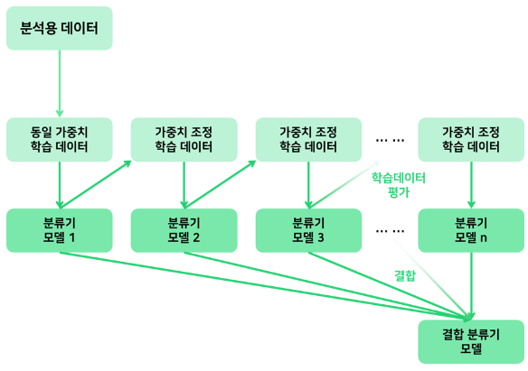

# III. 빅데이터 모델링

## 02. 분석기법 적용
---
### 2.1 분석기법

|-|KeyWord|
|:--:|--|
|회귀분석|회귀분석, 선형성, 독립성, 등분산성, 비상관성, 정상성, 최소제곱법, 회귀계수, 결정계수, F-통계량|
|로지스틱 회귀분석|로지스틱회귀분석, 다중공선성|
|의사결정나무|의사결정나무, 분류함수(분류규칙), 분리기준, 성장, 가지치기, 교차타당성, 카이제곱 통계량, 지니 지수, 엔트로피 지수, 순수도, CART, C4.5 & C5.0, CHAID, QUEST|
|인공신경망|인공신경망, 퍼셉트론, 활성함수, XOR문제, 다층퍼셉트론, 역전파알고리즘, 기울기소실, 활성화함수, 계단함수, 부호함수, 시그모이드, tanh함수, ReLU, Leaky ReLU, Softmax 함수|
|서포트 벡터 머신|SVM, 서포트벡터머신, 서포트벡터, 초평면, 슬랙변수, 커널트릭|
|연관성 분석|연관성분석, 지지도, 신뢰도, 향상도|
|군집 분석|군집분석, 계층적군집, k-평균군집, 혼합평균군집, EM알고리즘, 자기조직화지도(SOM), 최단연결법, 최장연결법, 중심연결법, 평균연결법, 와드연결법, 유클리드, 맨하튼, 민코프스키, 표준화, 마할라노비스 거리, 단순일치계수, 자카드계수, 순위상관계수|

============================================================
#### 1) 회귀분석
##### (1) 회귀 분석(Regression Analysis)
 - 1개 이상의 독립변수가 종속변수에 미치는 영향을 추정
 - 변수들 사이의 인과관계를 밝히고 모형을 적합하여 관심있는 변수를 예측/추론
 - 변수: 수식에 따라서 변하는 값
   - 영향을 주는 변수(x)/영향을 받는 변수(y)
   - 영향을 주는 변수 = 독립변수 = 설명변수 = 예측변수
   - 영향을 받는 변수 = 종속변수 = 반응변수 = 결과변수
 - 가정: 선형성 / 독립성 / 등분산성 / 비상관성 / 정상성
   - 단순모형: 선형성 검증 / 다중모형: 5개 가정 모두 검증
     - 선형성: 독립변수와 종속변수의 선형관계
     - 독립성: 잔차와 독립변수 상관X
     - 등분산성: 오차들의 분산 일정
     - 비상관성: 오차들 간 상관X
     - 정상성: 오차항(잔차항)이 정규분포
 - 모형 검증 체크리스트
   - 통계적 유의미 / 회귀계수 / 설명력 / 데이터 적합 / 가정 만족
   - 통계적 유의미: F-통계량, p-value 확인
   - 회귀계수: 계수의 T-통계량, p-value, 신뢰구간 확인
     - 계수(Coefficient): '인자'의 뜻으로 쓰이며 식 앞에 곱해지는 상수를 의미
   - 설명력: 결정계수 확인
   - 데이터 적합: 잔차 그래프 -> 회귀 진단
   - 가정 만족: 5개 가정 모두 만족하는지
 - 편차 vs. 오차 vs. 잔차
   - 편차(Deviation): 평균과의 차이 = 관측값이 평균값에서 떨어져 있는 정도
   - 오차(Error): 모집단에서 실젯값과 회귀선의 차이 즉, 정확치와 관측값의 차이
     - 예측하기 위한 추정치와 실젯값의 차이 = 예측값이 정확하지 못한 정도
   - 잔차(Residual): 표본에서 나온 관측값과 회귀선의 차이
     - 평균이 아닌, 회귀식 등으로 추정된 추정치와의 차이
     - 추정된 값을 설명할 수 없어서 아직도 남아있는 편차 = 편차 일부분

##### (2) 회귀 분석 유형
 - 단순선형 / 다중선형
 - 단순선형 회귀 분석(Simple Linear Regression Analysis)
   - 독립변수 1개 / 종속변수 1개 / 오차항 있는 선형관계
   - 회귀식: yi = β₀ + β₁xi + ei
     - 오차항 ei는 독립적, N(0, σ²)의 분포
   - 회귀계수 추정: 최소제곱법 사용하여 추정
     - 최소제곱법(Least Square Method): 오차 제곱의 합이 가장 최소가 되는 회귀계수를 찾음
   - 회귀분석 검정: 결정계수를 계산하여 결과가 적합한지 검증
     - 회귀계수 검정: β₀ = 0 이면, 추정식은 의미없음
     - 회귀직선 적합도/정확도 평가: 결정계수(R²) (0 ≤ R² ≤ 1) 
   - 선형회귀의 문제점
     - 0 이하의 값 or 1 이상의 값을 예측값으로 줄 수 있음 -> 확률값으로 직접 해석할 수 없음
   - 선형회귀와 제곱합
     
    

 - 다중선형 회귀 분석(Multi Linear Regression Analysis)
   - 독립변수 여러 개/ 종속변수 1개
   - 모형의 통계적 유의성: F-통계량으로 확인
     - F-통계량↑ p-value↓ -> p-value < 0.05 이면 귀무가설 기각 -> 모형이 통계적으로 유의
     - F = MSR/MSE = (SSR/k) / {SSE/(n-k-1)}
     - F-통계량: 분산이 동일하다고 가정되는 두 모집단으로부터, 독립적인 두 표본을 추출했을 때, 두 표본분산의 비율
   - 회귀분석 검정
     - 회귀계수: t-통계량
     - 회귀선: 결정계수
     - 모형적합성: 잔차와 종속변수의 산점도
     - 다중공선성: VIF, 상태지수
   - 다중공선성(Multicolinearity)
     - 다중회귀분석에서 독립변수들 간 선형관계가 존재한다면 정확한 회귀계수 추정 어려움
       - 분산팽창요인(VIF): 4 < VIF 다중공선성 존재 / 10 < VIF 심각한 문제
       - 상태지수: 10 < 상태지수 이면 문제있음 / 30 < 상태지수 이면 심각
       - 다중공선성 문제 발생 -> 변수 제거/주성분 회귀/능형 회귀 적용
         - 주성분회귀(PCR): 독립변수들의 주성분들을 추출하여 회귀모델을 만드는 기법
         - 능형회귀(Ridge Regression): 최소제곱합에 패널티 항을 추가하여 추정하여, 분산을 줄여주는 효과  
          
 - 주성분 분석: 서로 상관성이 높은 변수들을 선형결합으로 요약, 축소하는 기법
   - 변수들의 분산 방식의 패턴을 간결하게 표현하는 주성분 변수를 원래 변수의 선형결합으로 추출하는 통계기법
   - 분석을 통해 나타나는 주성분으로 변수들 사이의 구조를 쉽게 이해하는 건 어려움  
   -> 요약하는 게 주 목적

============================================================
#### 2) 로지스틱 회귀분석
##### (1) 로지스틱 회귀 분석(Logistic Regression Analysis)
 - 반응변수(종속변수)가 범주형, 분류 목적으로 사용
 - 새로운 설명변수(독립변수) 값이 주어질 때 반응변수(종속변수)의 각 범주에 속할 확률이 어느정도인지 추정하여 추정 확률을 기준치에 따라 분류
 - 클래스가 알려진 데이터에서 각 클래스내의 관측치들에 대한 유사성을 찾는 데 사용
 - 승산(오즈; Odds) = 실패에 비해 성공할 확률의 비 =  p / (1-p)
   - 회귀식
     - log( π(x) / (1-π(x)) ) = α + β₁x
     - π(x) = P(Y=1 | x)
   - 회귀계수 β₁ 부호에 따라 로지스틱 함수 그래프 모양이 달라짐  
   -> β₁ > 0 - S자  
   -> β₁ < 0 - 역 S자
   - R 함수
     - glm(): 모형 적합 함수
     - cdplot(): 연속형변수의 변화에 따른 범주형변수의 조건부분포 조회 (탐색적 분석)
     - step(): 변수 선택 함수

============================================================
#### 3) 의사결정나무
##### (1) 의사결정나무(Decision Tree)
 - 분류함수를 활용하여, 의사결정규칙으로 이루어진 나무 모양을 그리는 기법
 - 데이터가 가진 속성들로부터 분할기준 속성을 판별하고 이에 따라 트리형태로 모델링하는 분류예측모델
 - 분류함수: 분류 기준으로 사용되는 함수
   - 새로운 표본이 관측되었을 때 이 표본을 여러 모집단 중 어떤 하나의 모집단으로 분류하기 위한 함수
 - 시각화: 연속적인 의사결정문제 시각화 -> 의사결정 이루어지는 시점/성과파악을 쉽게 해줌
 - 해석용이: 계산결과가 직접적으로 나타남

##### (2) 의사결정나무의 구성요소
 - 부모마디 / 자식마디 / 뿌리마디 / 끝마디 / 중간마디 / 가지 / 깊이  
   

##### (3) 해석력과 예측력
 - 해석력: 예를 들어, 은행에서 신용평가 결과 부적격판정인 경우, 이유를 해석할 수 있어야 함
 - 예측력: 예를 들어, 반응이 좋을 고객 모집방안을 알고자 하는 경우, 예측력에 집중해야 함

##### (4) 의사결정나무의 분석
 - 분석 과정: 성장 -> 가지치기 -> 타당성평가 -> 해석및예측
   - 성장(Growing): 분리규칙으로 나무성장 -> 정지규칙 만족 시 중단
   - 가지치기(Pruning): 가지 제거(오류 위험/부적절한 추론규칙/불필요)
   - 타당성 평가: 교차 타당성 등으로 평가(이익 도표/위험 도표/시험 자료 등을 이용)
   - 해석 및 예측: 모형 해석 -> 데이터 분류 및 예측에 활용
 - 각 마디에서의 최적 분리규칙: 분리 변수 선택 & 분리 기준에 의해 결정됨
 - 분리변수의 P차원 공간에 대한 현재 분할은 이전 분할에 영향 받음
 - 성장(Growing): x 들로 이루어진 입력공간을 재귀적으로 분할하는 과정
   - 분류 규칙(Splitting Rule): 최적 분할은 불순도 감소량을 가장 크게 하는 분할
     - 연속형 분리변수: A = xi <= s
     - 범주형 분리변수: A = 1,2,4/ Ac = 3
   - 분리 기준(Splitting Criterion)
     - 한 부모마디에서 자식마디들이 형성될 때, 입력변수의 선택과 범주의 병합이 이루어질 기준
     - 순수도: 목표변수의 특정 범주에 개체들이 포함되어 있는 정도
     - 순수도/불순도 측정 -> 목표변수의 분포를 가장 잘 구별해주는 자식마디 형성
     - 부모보다 자식마디에서 순수도 증가
   - 이산형 목표변수에 사용되는 분리기준
     - 카이제곱 통계량의 p-value↓ / 지니 지수↓ / 엔트로피 지수 ↓
     - p-value가 가장 작은 예측변수&분리
     - 지니 지수를 가장 감소시켜주는 예측변수&분리
     - 엔트로피 지수가 가장 작은 예측변수&분리
   - 연속형 목표변수에 사용되는 분리기준
     - 분산분석의 F-통계량 / 분산의 감소량
     - F-통계량↑ p-value↓ p-value가 가장 작은 예측변수&분리
     - 분산의 감소량을 최대화하는 기준&분리
   - 정지 규칙(Stopping Rule)
     - 현재 마디가 끝마디가 되도록 하는 규칙
     - 나무 깊이 지정 / 끝마디 레코드 최소 개수 지정
       

 - 가지치기(Pruning)
   - 과대/과소 적합을 방지하기 위해 의사결정나무의 가지를 제거함
   - 의사결정나무의 크기 = 복잡도  
   -> 크기가 너무 크면 과대적합 / 너무 작으면 과소적합 위험
   - 최적의 크기(복잡도)는 대상자료로부터 추정
   - 분류 오류를 크게할 위험 or 부적절한 규칙을 가진 가지를 제거함
   - 나무의 끝마디가 너무 나오면, 모형이 과대적합되어 규칙을 현실 문제에 적용할 수 없음  
   -> 분류된 관측치의 비율 or MSE 등을 고려하여 과적합 문제를 해결하기 위해 가지치기를 함

##### (5) 의사결정나무 알고리즘
 - CART / C4.5 & C5.0 / CHAID / QUEST  
 

 - 편향(Bias): 학습 알고리즘에서 잘못된 가정을 했을 때 발생하는 오차

##### (6) 의사결정나무 종류
 - 분류나무 / 회귀나무 모형
 - 의사결정나무는 주어진 입력값에 대해 출력값을 예측하는 모형

##### (7) 의사결정나무 활용 및 장단점
 - 활용: 세분화 / 분류 / 예측 / 차원축소 및 변수선택 / 교호작용 효과 파악
   - 차원축소 및 변수선택: 목표변수에 큰 영향을 미치는 예측변수들을 구분하고자 할 때
   - 교호작용 효과 파악: 여러 예측변수 결합  
   -> 범주의 병합 or 연속형 변수의 이산화
     - 교호작용(Interaction): 독립변수간 상호작용이 종속변수에 영향을 주는 현상
 - 장점: 해석 용이 / 상호작용 효과 해석 가능 / 비모수적 모형 / 유연성 및 정확도 높음
   - 비모수적 모형: 가정 필요X, 이상값에 민감X
   - 유연성 및 정확도 높음: 대용량 데이터에서도 빠르게 생성 가능
 - 단점: 비연속성 / 선형성 or 주효과 결여 / 비안정성

   - 비연속성: 연속형변수를 비연속적 값으로 취급 -> 경계점 근방에서 예측오류 가능성 큼
   - 선형성 or 주효과 결여: 선형모형에서는 각 변수의 영향력을 해석할 수 있는데, 의사결정나무는 불가능
   - 비안정성: Training Data에만 의존하면 과대적합 가능성 -> 검증용데이터로 교차타당성 평가 or 가지치기 필요
 - 평가: 이익 도표 or 검정용 데이터에 의한 교차 타당성 등을 이용하여, 의사결정나무를 평가함

============================================================
#### 4) 인공신경망
##### (1) 인공신경망
 - 뉴런의 전기신호 전달을 모방한 기계학습 모델
 - 인공신경망(ANN; Artificial Neural Network)
   - 입력값 받아서 출력값 만들기 위해 활성화 함수 사용함
 - 활성화 함수/활성 함수(Activation Function)
   - 입력신호의 총합을 출력신호로 변환하는 함수
   - 입력받은 신호를 얼마나 출력할지 결정
   - 출력된 신호의 활성화 여부 결정
 - 신경망 모형의 특징
   - 변수가 많은 경우나 입출력 변수간 복잡한 비선형 관계일 때 유용함
   - 잡음에 민감하지 않음
   - 은닉층 너무 많으면, 과대적합 위험
   - 은닉층 너무 적으면, 충분한 데이터 표현X

##### (2) 인공신경망의 역사
 - 퍼셉트론과 XOR 선형 분리 불가 문제 -> 다층 퍼셉트론과 기울기 소실 문제 -> 인공지능과 딥러닝  
 

##### (3) 인공신경망의 구조
 - 퍼셉트론 / 다층 퍼셉트론
 - 퍼셉트론(Perceptron) 구성
   - 입력값 / 가중치 / 순 입력함수 / 활성함수/ 출력값(예측값)
   - 입력값: 훈련 데이터(Training Data)
   - 순 입력함수: 함수에서 모든 입력값과 가중치를 곱하고 Sum
   - 활성 함수
     - 순 입력함수에서 나온 값과 임계값 비교 -> 출력값(예측값)으로 1 or -1
     - 예측값 != 실젯값 -> 가중치 업데이트 -> 이 과정을 반복하면서 학습
 - 퍼셉트론 문제점: XOR 선형 분리 불가 문제 -> 해결 위해 다층 퍼셉트론 등장
   - AND 연산: 입력값 (X, Y) 이 모두 1이면 1 출력 / 나머지는 0 → 선형분리 가능
   - OR 연산: 입력값 (X, Y) 이 모두 0이면 0 출력/ 나머지는 1 → 선형분리 가능
   - XOR 연산: 입력값 (X, Y) 이 같으면 0 출력/ 다르면 1 출력 → 선형분리 불가능
 - 퍼셉트론의 구조  
 

 - 다층 퍼셉트론(MLP; Multi-Layer Perceptrons)
   - 비선형적으로 분리되는 데이터에 대한 학습이 가능한 퍼셉트론
   - 구성: 입력층과 출력층 사이에 1개 이상의 은닉층
   - 활성화 함수: 시그모이드 함수(Sigmoid Function)
     - 시그모이드: 유한한 영역 가짐/미분가능/모든 점에서 음이 아닌 미분값/하나의 변곡점
   - 역전파 알고리즘을 통해 다층에서 학습 가능
     - 예측값과 실젯값의 차이인 에러(Error)를 통해 가중치 조정 -> 연결 강도 갱신 -> 목적함수 최적화
 - 다층 퍼셉트론의 문제점: 과대 적합 / 기울기 소실
   - 과대 적합: 학습 데이터가 부족하면 실제 데이터에서 성능 떨어짐 -> 빅데이터 확보 가능해지면서 해결
   - 기울기 소실: 시그모이드 함수의 편미분을 진행하면 기울기가 0에 근사 -> ReLU, tanh 함수 사용하여 해결
 - 다층 퍼셉트론의 구조  
 

##### (4) 뉴런의 활성화 함수
 - 순 입력함수에서 전달받은 값을 출력값으로 변환하는 함수
 - 계단 / 부호 / 시그모이드 / tanh / ReLU / Leaky ReLU / Softmax 함수
 - Dying ReLU: ReLU 함수에서 마이너스(-) 값 -> 전부 0을 출력 -> 일부 가중치들이 업데이트 되지 않음
   

============================================================
#### 5) 서포트 벡터 머신
##### (1) 서포트 벡터 머신(SVM; Support Vector Machine)
 - 지도학습 / 이진선형분류
 - 서포트 벡터 머신
   - 데이터들과의 거리가 가장 먼 초평면을 선택하여 분리하는 지도학습 기반의 이진 선형 분류 모델
 - 기준: 초평면(Hyperplane)을 기준으로 데이터를 분리함
 - 활용: 사물 / 패턴 / 손글씨 숫자 인식 등
 - 서포트 벡터 머신 특징
   - 공간상 최적의 분리 초평면을 찾음 -> 분류 및 회귀
   - 변수 속성 간 의존성 고려X
   - 모든 속성 활용
   - 훈련시간 느린 편 / 그러나 정확성↑ 
   - 다른 방법보다 과대적합 가능성↓
   - R package: e1071, kernlab, klaR 등  
    
 - 서포트 벡터 머신  
 

##### (2) 서포트 벡터 머신 종류
 - 하드 마진 SVM / 소프트 마진 SVM
 - 하드 마진(Hard Margin): 오분류 허용X -> 노이즈로 최적의 결정경계 잘못 찾음 or 못 찾음
 - 소프트 마진(Soft Margin): 오분류 허용O -> 어느정도 오류를 허용하는 소프트 마진을 주로 이용함

##### (3) 서포트 벡터 머신의 구성요소
 - 결정경계 / 초평면 / 마진 / 서포트벡터 / 슬랙변수(여유변수)
 - 결정 경계(Decision Boundary): 데이터 분류 기준
 - 초평면(Hyperplane): N차원 공간의 (N-1)차원 평면(데이터 분리)
 - 마진(Margin, 여유공간): 결정 경계 ~ 서포트 벡터 간 거리 -> 이 마진을 최대화하는 것이 최적의 결정 경계
 - 서포트 벡터(Support Vector): 결정 경계와 가장 가까운 데이터들의 집합(학습 데이터 중에서)
 - 슬랙 변수(Slack Variable, 여유변수): 완벽한 분리 불가능할 경우 -> 허용된 오차를 위한 변수(소프트 마진 SVM에서)

##### (4) 서포트 벡터 머신 적용 기준
 - 선형으로 분리 가능/불가능 여부
 - 선형 분리 가능 SVM: 최적 결정 경계(초평면) 기준으로 +1 과 -1 로 구분 -> 분류 모델
 - 선형 분리 불가능 SVM: 커널 트릭 활용
   - 커널 함수: 저차원에서 함수의 계산만으로 원하는 풀이가 가능한 함수
   - 커널 트릭: 커널 함수를 이용하여, 고차원 공간으로 매핑하면서 증가하는 연산량의 문제를 해결하는 기법  
   -> 따라서, 저차원 공간을 고차원 공간으로 매핑할 때 발생하는 연산의 복잡성을 커널 트릭으로 해결가능
   - (예) 2차원에서 분류할 수 없는 문제를 3차원 공간에 매핑하여 선형 분류
   - 대표적인 커널 함수: 가우시안 RBF 커널/다항식 커널/시그모이드 커널 등
     - 커널 함수 선택에 명확한 규칙X, 정확도 차이 별로X

============================================================
#### 6) 연관성 분석
##### (1) 연관성 분석(Association Analysis)
 - 데이터 간 관계에서 조건과 반응을 연결하는 분석
 - 연관성 분석 = 장바구니 분석 = 서열 분석
   - 데이터 내부에 존재하는 항목간 상호관계 or 종속관계를 찾아내는 분석방법
 - 연관성 분석 특징
   - 목적변수X -> 분석 방향 or 목적 없어도 적용 가능
   - 조건-반응(IF-THEN)으로 표현-> 결과 이해 쉬움
   - 계산 매우 간단
   - 세분화 특징
     - 장점: 적절한 세분화로 인한 품목 결정
     - 단점: 너무 세분화되면 의미 없는 결과

##### (2) 연관성 분석의 주요 용어
 - 지지도 / 신뢰도 / 향상도  
 
 
 - 향상도 (Lift): 1을 기준으로 A, B 사이의 상관관계 측정
   - 향상도 = 1 : A, B가 서로 독립적
   - 향상도 < 1 : A, B가 음의 상관관계(-)
   - 향상도 > 1 : A, B가 양의 상관관계(+)

============================================================
#### 7) 군집 분석
##### (1) 군집 분석(Cluster Analysis)
 - 데이터를 집단화 / 다변량 분석기법
 - 여러 개의 변숫값들로부터 유사성(Similarity)만 기초로 n개의 군집으로 집단화하여 집단의 특성을 분석하는 다변량 분석기법
 - 군집 분석 종류: 계층적 군집/k-평균 군집/혼합 분포 군집/자기 조직화 지도(SOM)
 - 계층적 군집: 군집 개수 미리 정하지 않음 -> 병합적 방법/분할적 방법/덴드로그램
 - 비계층적 군집: 군집 개수 k 미리 정함 -> k-평균 군집/혼합 분포 군집/자기 조직화 지도

##### (2) 계층적 군집(Hierarchical Clustering)
 - 유사한 개체들의 군집화 과정 반복
 - 군집 형성 방법: 병합적 방법 / 분할적 방법
   - 병합적 방법(Agglomerative): 작은 군집 -> 병합
     - 거리 가까우면 유사성 높음
     - R : {stats} hclust(), {cluster} agnes(), mclust()
   - 분할적 방법(Divisive): 큰 군집 -> 분리
     - R : {cluster} diana(), mona()
 - 군집 결과 표현: 계통도 / 덴드로그램
   - 덴드로그램(Dendrogram): 군집의 개체들이 결합되는 순서를 나타내는 트리 구조
   - 항목간 거리/군집간 거리/군집내 항목간 유사도/군집의 견고성 파악 가능
   - 각 개체는 한 군집에만 속함
 - 군집간 거리 측정 방법/연결법: 최단연결법/최장연결법/중심연결법/평균연결법/와드연결법
   - 최단연결법 = 단일연결법: 두 군집간 거리 = 최솟값 으로 측정
     - 각 군집에서 한 개체씩 뽑았을 때 나타날 수 있는 최솟값을 군집간 거리로 측정함
   - 최장연결법 = 완전연결법: 두 군집간 거리 = 최댓값 으로 측정
     - 각 군집에서 한 개체씩 뽑았을 때 나타날 수 있는 최댓값을 군집간 거리로 측정함
   - 중심연결법: 두 군집 중심 사이 거리 측정
     - 두 군집 결합 -> 가중평균으로 새로운 군집의 평균 구함
     - 군집 내 편차 제곱합 고려 -> 군집간 정보 손실을 최소화
   - 평균연결법: 모든 개체에 대한 거리 평균 구하면서 군집화
     - 계산량이 불필요하게 많아질 가능성 존재
   - 와드연결법: 군집내 오차 제곱합 기반으로 군집화
     - 다른 연결법들은 군집간 거리에 기반하는데, 와드연결법은 군집내 거리를 기반으로 함
 - 군집간 거리 계산: 연속형/명목형/순서형 변수마다 거리 계산 방법 다름
   - 연속형 변수 거리: 유클리드/맨하튼/민코프스키/표준화/마할라노비스 거리
     - 유클리드 거리: 두 점을 잇는 가장 짧은 직선 거리
     - 맨하튼 거리(시가 거리): 각 방향 직각의 이동 거리 합
     - 민코프스키 거리: 1차원일 때 맨하튼 거리, 2차원일 때 유클리드 거리와 같음
     - 표준화 거리: 각 변수를 표준편차로 변환한 후, 유클리드 거리를 계산
     - 마할라노비스 거리: 변수들의 산포를 고려하여 표준화한 거리  
     변수의 표준편차 고려 / 변수간 상관성이 있으면 표준화 거리 사용 검토해야 함
   - 명목형 변수 거리: 단순 일치 계수 / 자카드 계수
     - 모든 변수가 명목형인 경우, (두 개체간 다른 값을 가지는 변수의 수)를 (총 변수의 수)로 나눈 것이 거리임
     - 자카드 계수는 두 집합이 같으면 1, 공통 원소가 없으면 0
   - 순서형 변수 거리: 순위상관계수  
   
 

##### (3) k-평균 군집(k-means clustering)
 - k 개의 군집 묶음 -> 군집 평균 재계산 -> 반복
 - 주어진 데이터를 k개의 군집으로 묶는 알고리즘
   - 초기 군집을 k개 지정하고 각 개체를 가까운 군집에 할당하여 군집을 형성한 다음 각 군집 평균을 재계산하고 군집 갱신을 반복하여 k개의 최종 군집을 형성
 - 절차: k개 객체 선택 -> 할당 -> 중심 갱신 -> 반복
   - k개 객체 선택: 초기 군집의 중심으로 삼을 객체 k개를 랜덤 선택
   - 할당(Assignment): 각 객체들을 가장 가까운 군집의 중심에 할당
   - 중심 갱신(New Centroids): 각 군집별로 평균 계산 -> 군집 중심 갱신
   - 반복: 군집 중심의 변화가 거의 없을 때까지/최대 반복수에 도달할 때까지 할당과 중심 갱신을 반복
 - 단점: 이상값에 민감 -> k-중앙값 군집 or 이상값 미리 제거

##### (4) 혼합 분포 군집(Mixture Distribution Clustering)
 - 모수적 모형 기반 군집화 방법
 - 혼합 분포 군집
   - 데이터가 k개의 모수적 모형의 가중합으로 표현되는 모집단 모형에서 나왔다는 가정 하에 데이터로부터 모수&가중치를 추정하는 방법
 - k개의 모형 = k개의 군집 을 의미함
 - 군집화 방법
   - 추정된 k개의 모형(군집)들 중에서 어느 모형에서 나왔을 확률이 높은지에 따라서 각각의 데이터를 군집으로 분류
 - 혼합모형 = M개 분포(성분)의 가중합
   - 단일모형과 비교하면, 혼합모형은 표현식이 복잡함 -> 미분을 통한 이론적 전개가 어려움
   - 최대가능도 추정을 위해 EM알고리즘을 활용함
 - EM 알고리즘(Expectation-Maximization Algorithm, 기댓값 최대화 알고리즘)
   - 관찰/측정되지 않은 잠재변수에 의존하는 확률모델에서 최대 가능도나 최대 사후 확률을 가지는 모수의 추정값을 찾는 반복적인 알고리즘
     - 최대 가능도(Maximum Likelihood): 어떤 모수가 주어졌을 때, 원하는 값들이 나올 가능도를 최대로 만드는 모수를 선택하는 방법
 - 진행과정: E-step -> M-step
   - E-step: 잠재변수 Z의 기대치 계산
   - M-step: 기대치 이용하여 파라미터 추정
   - 반복: M-step에서 계산된 값은 다음 E-step에서 추정값으로 쓰임
 - 특징
   - 확률분포 도입하여 군집화
   - 군집을 모수로 표현
   - 서로 다른 크기의 군집 찾을 수 있음
   - 데이터 커지면 수렴 시간 걸림
   - 군집 크기 너무 작으면 추정 정도 떨어짐
   - 이상값 민감 -> 사전 조치 필요

##### (5) 자기 조직화 지도(SOM; Self-Organizing Maps): 비지도 신경망 클러스터링
 - 자기 조직화 지도
   - 대뇌피질, 시각피질의 학습과정을 기반으로 모델화한 인공신경망
   - 자율학습방법에 의한 클러스터링 방법을 적용한 알고리즘
   - 고차원 데이터를 이해하기 쉬운 저차원 뉴런으로 정렬 -> 지도로 형상화한 비지도 신경망
 - 구성: 입력층 / 경쟁층  
   

 - 특징: 입력변수의 위치관계를 그대로 보존하여 형상화 -> 실제 공간에 가까이 있으면 지도상에도 가까운 위치
 - 학습과정: 경쟁학습 / 승자독식구조
   - 경쟁학습: 경쟁층의 각 뉴런이 입력벡터와 얼마나 가까운지 계산  
   -> 연결강도를 반복적으로 재조정하여 학습  
   -> 입력패턴과 가장 유사한 경쟁층 뉴런이 승자
   - 승자독식구조: 경쟁층에 승자 뉴런만 나타남  
   -> 승자와 유사한 연결강도를 가지는 입력패턴이 동일한 경쟁 뉴런으로 배열됨
   - 연결강도 초기화 -> 입력벡터 제시 -> 유사도 계산 -> 프로토타입 벡터 탐색 -> 연결강도 재조정 -> 반복
     - 프로토타입 벡터 탐색: 입력벡터와 가장 가까운 뉴런인 BMU(Best Matching Unit)을 탐색하는 단계

---
### 2.2 고급 분석기법

|-|KeyWord|
|:--:|--|
|범주형 자료 분석|분할표분석, 상대위험도, 승산비, 카이제곱분석, 교차분석, 적합도검정, 독립성검정, 동질성검정, 피셔정확검정|
|다변량 분석|다변량분석, 피어슨상관계수, 스피어만상관계수, 다차원척도법, 주성분분석|
|시계열 분석|시계열분석, 정상성, 자기회귀모형(AR모형), 이동평균모형(MA모형), 자기회귀 누적 이동평균모형(ARIMA모형), 백색잡음과정, 분해시계열, 추세요인, 계절요인, 순환요인, 불규칙 요인|
|베이지안 기법|확률, 교사건, 표본 평균, 표본 분산, 표본 표준편차, 표본 공분산, 상관계수, 상관계수 행렬, 조건부확률, 전확률의정리, 베이즈정리, 베이즈확률|
|딥러닝 분석|딥러닝, DNN, 은닉층, 역전파, CNN, 컨볼루션, 피처맵, 서브샘플링, RNN|
|비정형 데이터 분석|사회연결망분석(SNA), 연결정도, 포괄성, 밀도, 연결정도 중심성, 근접 중심성, 매개 중심성, 감성분석, 오피니언마이닝, 텍스트마이닝, 웹마이닝|
|앙상블 분석|앙상블분석, 배깅, 부트스트랩, 부스팅, AdaBoost, 랜덤포레스트, 배깅을 이용한 포레스트 구성, 임의노드 최적화, 중요 매개변수, 포레스트 크기, 최대 허용 깊이, 임의성 정도|
|비모수 통계|비모수통계, 부호 검정, 윌콕슨 부호 순위 검정, 윌콕슨 순위 합 검정, 대응 표본 검정, 크루스칼-왈리스 검정, 런 검정|

============================================================
#### 1) 범주형 자료 분석
##### (1) 범주형 자료 분석
 - 분할표 분석 / 카이제곱 분석 / 피셔 정확 검정 / 로지스틱 회귀분석
 - 범주형 자료 분석
   - 종속변수: 1개 / 범주형
   - 종속변수가 1개이고 범주형인 데이터를 분석하여, 모형과 독립변수의 유의성을 알아봄
 - 독립변수(X)의 척도에 따른 분석방법
   - 독립변수가 범주형: 분할표 분석/카이제곱 검정(교차 분석)/피셔 정확 검정
   - 독립변수가 연속형: 로지스틱 회귀분석

##### (2) 분할표 분석(Contingency Table)
 - 상대위험도(RR) / 승산비(Odds Ratio)  
 

 - 분할표
   - 범주형 변수 개수에 따라 1원/2원/다원 분할표
   - 행: 독립변수 / 열: 종속변수
   - 주변합(Margin Sum): 마지막 행열에 총계 데이터
 - 상대위험도(RR; Relative Risk) = {a/(a+b)}/{c/(c+d)}: 비교 집단의 위험률 대비 관심있는 집단의 위험률
   - (관심 집단 위험률)/(비교 집단 위험률)= {a/(a+b)}/{c/(c+d)}
   - 위험률: 특정 사건이 발생할 비율
   - 1을 기준으로 평가함
     - RR < 1: 관심 집단의 특정 사건 발생확률 낮음
     - RR = 1: 관심 집단과 특정 사건의 발생에 연관성 없음
     - RR > 1: 관심 집단의 특정 사건 발생확률 높음
 - 승산비(Odds Ratio) = 교차비 = 대응위험도
   - 승산 = p / (1 - p): 특정 사건이 발생하지 않을 확률 대비, 발생할 확률  
    = (특정 사건 발생 확률) / (발생하지 않을 확률)  
    = (이길 확률) / (1 - 이길확률) = p / (1 - p)
   - 승산비 = ad / bc: 비교 집단의 승산 대비, 관심 있는 집단의 승산  
   = (관심 집단의 승산) / (비교 집단의 승산)  
   = (특정 조건이 있을 때의 오즈) / (다른 조건이 있을 때의 오즈)  
   = (a / b) / (c / d) = ad / bc (교차비)

##### (3) 카이제곱 분석(Chi-Squared Test) = 교차 분석
 - 적합도 검정 / 독립성 검정 / 동질성 검정
 - 분석 방법: χ²(카이제곱 값) 계산 -> p-value가 유의수준보다 작으면 귀무가설 기각
   - 카이제곱 값=Σ(관측빈도-기대빈도)²/(기대빈도)
     - 관측빈도와 기대빈도의 차이인 편차의 제곱 값을 기대빈도로 나눈 값들의 합
  

##### (4) 피셔의 정확 검정(Fisher's Exact Test)
 - 분할표 문제로 카이제곱검정의 정확도가 떨어지는 경우 사용하는 방법
 - 피셔 정확 검정을 사용하는 경우
   - 표본 수가 적은 경우
   - 분할표에서 셀에 치우치게 분포된 경우
   - 기대빈도가 5 미만인 셀이 20% 넘는 경우
     - 기대빈도: 두 변수가 독립일 경우에 이론적으로 기대할 수 있는 빈도 분포 / 예상되는 빈도

============================================================
#### 2) 다변량 분석
##### (1) 상관분석
 - 피어슨 상관계수 / 스피어만 순위 상관계수
 - 피어슨 상관계수: 두 변수간 선형관계의 크기를 측정(비선형관계는 측정X)
   - 등간 척도 or 비례 척도를 사용하는 연속형 데이터에서 사용
   - 계산방법: 두 변수의 공분산을 표준편차의 곱으로 나눈 값  
   = Corr (X, Y) = Cov (X, Y) / √Var(X)Var(Y)
   - 모집단 - 모 상관계수 (ρ) / 표본집단 - 표본 상관계수 (r)
   - -1 에서 +1 사이의 값
 - 스피어만 순위 상관계수: 두 변수간 비선형적인 관계도 나타낼 수 있음
   - 계산방법: 두 변수를 모두 순위로 변환 -> 두 순위간 피어슨 상관계수 계산
   - -1 에서 +1 사이의 값

##### (2) 다차원 척도법
 - 개체들 사이의 유사성(비유사성)을 측정하여 시각적으로 표현
 - 다차원 척도법(MDS; MultiDimensionality Scaling)
   - 개체들 사이의 유사성, 비유사성을 측정하여 2차원 or 3차원 공간상에 점으로 표현하여 개체들 사이의 집단화를 시각적으로 표현하는 분석 방법
 - 여러 대상간의 거리가 주어져 있을 때, 대상들을 동일한 상대적 거리를 가진 실수 공간의 점들로 배치시키는 방법
 - 주어진 거리는 추상적인 대상들 간 거리 & 실수 공간에서의 거리 둘 다 될 수 있음
 - 주로 자료들의 상대적 관계를 이해하는 시각화 방법의 근간으로 사용됨  

##### (3) 주성분 분석
 - 고차원 자료의 차원을 축소(축약)시킴 / 상관성 높은 변수들을 요약함
 - 주성분 분석(PCA; Principal Component Analysis)
   - 상관관계가 있는 고차원 자료의 원래 변동을 최대한 보존하여 저차원 자료로 변환하는 차원축소 방법
 - 차원축소: 많은 변수들로 구성된 고차원 자료를 축소하여, 새로운 차원의 자료를 생성하는 기법
   - 고윳값(Eigenvalue)이 높은 순서로 정렬 -> 높은 고윳값을 가진 고유벡터(Eigenvector)만으로 데이터 복원
 - 주성분 분석의 특징
   - p개의 변수들을 중요한 m(P)개의 주성분으로 표현 -> 전체 변동을 설명
     - p차원 변수 X = (X1, X2, ... , Xp)^T
   - 주성분은 원래 변수들의 선형결합으로 표현됨
     - 기존의 상관성이 높은 변수들을 요약, 축소시킴
   - 차원 감소폭 결정: 스크린 산점도/전체 변이의 공헌도/평균 고윳값 등을 활용
   - 누적 기여율 85% 이상 -> 주성분 수로 결정 가능
     - 누적 기여율: 제 1 ~ k 주성분까지의 주성분을 이용하여 설명할 수 있는 데이터 전체 정보량의 비율
   - 주성분으로 변수들 사이의 구조를 쉽게 이해하기는 어려움
   - 차원의 저주 해결
     - 데이터 차원이 증가할 때, 데이터 구조를 변환하여 정보를 최대한 축적하는 차원 감소방법으로 해결

============================================================
#### 3) 시계열 분석
##### (1) 시계열 분석
  - 연도별/분기별/월별 등 시계열로 관측되는 자료를 분석 -> 미래 예측
 - 시계열로 관측 -> x축 시간 & y축 관측값
 - 추세를 분석 -> 미래를 예측
 - 시계열 데이터: 규칙적 / 불규칙적인 특징 가짐

##### (2) 정상성(Stationary)
 - 시점에 상관없이 시계열의 특성이 일정함
 - 정상성을 만족해야, 시계열 분석이 가능함
 - 정상성 조건: 평균 일정/분산&공분산이 시점에 의존하지 않음/공분산은 시차에만 의존함
 - 기댓값과 분포가 시점에 따라서 달라지지 않는다면, 정상성을 만족한다고 할 수 있음

##### (3) 시계열 모형
 - 자기회귀모형(AR모형)/이동평균모형(MA모형)/자기회귀 누적 이동평균모형(ARIMA모형)
 - 자기 회귀 모형(AR모형)(Auto-Regressive Model)
   - 현시점의 자료가 p시점 전의 유한 개의 과거 자료로 설명될 수 있음
   - 과거 p번째까지의 데이터가 현재 데이터에 영향을 준다면 AR(p) 모형
   - 관심있는 변수의 과거 값들의 선형결합을 이용하여, 자기 자신에 대한 미래 값을 예측
   - 과거 관측값의 오차항이 미래 관측값에 영향을 줌
 - 이동평균 모형(MA모형)(Moving Average Model)
   - 시간이 지날수록 관측치의 평균값이 지속적으로 증가or감소하는 시계열 모형
   - 현시점의 자료가 p시점 전의 유한 개의 과거 백색잡음의 선형결합으로 표현됨
   - 자신의 과거 값을 사용하여 설명하는 시계열 모형 -> 정상 확률 모형/항상 정상성 만족 -> 정상성가정 필요없음
   -  과거의 연속적인 오차항이 현재/미래 관측값에 영향을 줌
   - [백색잡음(오차항)의 현재값] & [자기자신의 과거값]의 선형 가중합
 - 자기 회귀 누적 이동평균 모형(ARIMA모형)(Auto Regressive Integrated Moving Average Model)
   - 분기/반기/연간 단위로 다음 지표를 예측하거나, 주간/월간 단위로 지표를 리뷰하여 트렌드를 분석
   - 시계열의 비정상성을 설명하기 위해, 관측치간의 차분을 사용
   - 비정상 시계열 모형 -> 차분 or 변환 -> AR or MA or ARMA 모형으로 정상화
   - Integrated는 누적을 의미하는데, 차분을 이용하는 시계열 모형에서 이 표현을 사용
 - 백색잡음(White Noise): 모든 개별 확률변수들이 서로 독립이고 동일한 확률분포를 따르는 확률과정을 말함(I.I.D.)
 -백색잡음과정(White Noise Process): 백색잡음과정 a(t)는 독립이고 같은 분포를 따르며 확률변수임(평균 = 0)  

 - 분해 시계열: 시계열에 영향 주는 일반적인 요인을 시계열에서 분리하여 분석하는 방법 -> 분해식 사용
   - 회귀 분석적인 방법을 주로 사용  
   -> 관찰된 연속형 변수들에 대해, 두 변수 사이의 모형을 구한 뒤 적합도를 측정하는 분석 방법
   - 시계열 구성요소: 추세 / 계절 / 순환 / 불규칙 요인  

============================================================
#### 4) 베이지안 기법
##### (1) 확률 및 기본 통계이론
 - 확률 (Probability)
   - 비슷한 현상이 반복해서 일어날 경우 어떤 사건이 발생할 가능성을 숫자로 표현하는 방법
   - 같은 원인에서 특정한 결과가 나타나는 비율
 - 교사건(Intersection of Events)
   - P(A⋂B) = 사건 A, B에 동시에 속하는 기본 결과들의 모임  
     
 

 - 통계 파라미터
   - 표본 평균/표본 분산/표본 표준편차/표본 공분산/상관계수/상관계수 행렬
   - 표본 공분산(Sample Covariance)
     - 2개 이상의 변량 데이터가 주어질 경우, 각 변량간의 변화하는 양상을 나타내는 통계적 척도
     - 2가지 변수(x, y)가 변하는 정도를 수로 나타냄
     - 한 변수가 변할 때 다른 변수가 변하는 정도/두 변수가 동시에 변하는 정도
   - 변량(Variance): 조사내용으로서의 특성을 수량으로 나타낸 값(연속 변량, 이산 변량)  
 

##### (2) 조건부 확률(Conditional Probability)
 - 어떤 사건이 일어난다는 조건에서 다른 사건이 일어날 확률
 - 2개의 사건 A, B에 대하여, 사건 A가 일어난다는 선행조건 하에 사건 B가 일어날 확률
 - A -> B 조건부 확률 P(B|A) = P(A⋂B) / P(A),  P(A) ≠ 0
 - B -> A 조건부 확률 P(A|B) = P(A⋂B) / P(B),  P(B) ≠ 0

##### (3) 전 확률의 정리(Law of Total Probability)
 - 사건의 원인을 나눔 -> 원인이 되는 확률의 가중합으로 사건의 확률을 구함
 - 나중에 주어지는 사건 A의 확률을 구할 때, 사건 A의 원인을 여러가지로 나누어서 각 원인에 대한 조건부 확률P(A|Bi)과 그 원인이 되는 확률P(Bi)의 곱에 의한 가중합으로 구할 수 있음
 - 전 확률의 정리 공식
   - P(A)  
   = P(B1 ⋂ A) + P(B2 ⋂ A) + ... + P(Bn ⋂ A)  
   = P(B1) P(A|B1) + P(B2) P(A|B2) + ... +P(Bn) P(A|Bn)  
   = ∑ P(Bi) P(A|Bi)

##### (4) 베이즈 정리(Bayes' Theorem)
 - 어떤 사건에 대해 관측 전 원인에 대한 가능성과 관측 후 원인 가능성 사이의 관계를 설명
 - 두 확률변수의 사전확률과 사후확률 사이의 관계를 설명하는 확률이론
 - 베이즈 확률
   - 어떤 사건 B가 서로 배반인 A1, A2, ... , An 중에서 어느 한 가지 경우로 발생하는 경우, 실제 B가 발생할 때, 이것이 Ai일 확률
 - P(Ai|B)
   - B를 표본공간S 내 임의의 사상(집합)이라고 하고 서로 배반인 사상 A1, A2, ... , An 의 합 사상 = 표본공간S라고 하면 B사건을 근거로 Ai사건이 발생할 확률  

============================================================
#### 5) 딥러닝 분석
##### (1) 딥러닝(Deep Learning)
 - 딥러닝 ⊂ 머신러닝 ⊂ 인공지능
 - 여러 비선형 변환기법의 조합을 통해 높은 수준의 추상화를 시도하는 기계학습 알고리즘의 집합
   - 추상화(Abstraction): 많고 복잡한 데이터를 핵심 요약
 - 딥러닝 부각이유
   - 기울기 소실 해결: 기존 인공신경망 모델의 문제점이었음
   - 분석 시간의 단축: 강력한 GPU를 연산에 활용함 -> 하드웨어 연산속도↑
   - 데이터 확보 가능: 빅데이터 등장 & SNS 활용↑

##### (2) 딥러닝 알고리즘
 - DNN / CNN / RNN / GAN ...
 - DNN(Deep Neural Network): 은닉층을 심층 구성한 신경망
   - 입력층, 여러 개의 은닉층(Hidden Layer), 출력층으로 이루어진 인공신경망(ANN)
     - 입력층: 가중치를 곱하고, 은닉층으로 이동
     - 은닉층: 가중치를 곱하면서 다음 계층으로 이동
   - 역전파 알고리즘
     - 출력층, 은닉층, 입력층 순서로 역방향 수행 반복 -> 최적화된 결과 도출
     - 일반적인 인공신경망과 마찬가지로, 복잡한 비선형 관계들을 모델링할 수 있음
     - 여러 은닉층을 통해, 더 적은 수의 유닛으로도 복잡한 데이터를 모델링할 수 있게 해줌
 - CNN(Convolutional Neural Network)(합성곱 신경망)
   - 필터 기능과 신경망을 결합
   - 필터 기능(Convolution): 기존 영상처리의 필터 기능을 의미함
   - 필터 기능을 통해 입력이미지에서 특징 추출 -> 다층 신경망을 통해 분류 수행
   - 여러 개의 컨볼루션 층(합성곱 층) & 서브샘플링 층(풀링 층)으로 이루어진 인공신경망
   - 입력층 합성곱 연산
     - 필터로 입력이미지에서 특징(피처) 추출 -> 피처맵 구성
     - 피처맵(Feature Map): 이미지 추출 시, 환경변화에 잘 적응하는 강인한 특징을 유도한 2차원 맵
     - 환경변화: 왜곡, 변형 등을 의미함
   - 피처맵에서 서브샘플링 연산
     - 피처맵에서 서브샘플링 연산 -> 화면 크기 축소
     - 서브샘플링 층(Subsampling): 만들어진 피처맵에 대해 공간적 해상도를 줄인 뉴런층
     - 서브샘플링을 통해, 차원 축소 -> 문제 복잡도 축소
     - 연산자: 최대 풀링(Max Pooling)/최소 풀링(Min Pooling)/평균 풀링(Average Pooling) 등
     - 최대 풀링은 최댓값, 최소 풀링은 최솟값, 평균 풀링은 평균값을 취함
     - 풀링을 통해서 차원 축소 뿐만 아니라, 피처맵이 이동이나 왜곡에 대해 강인해지도록 할 수 있음
   - 피처맵에서 합성곱&서브샘플링 반복연산: 반복하여 최적화된 피처맵 구성
   - 완전연결계층에서 다층신경망으로 분류수행
     - 완전연결계층 -> 1차원 행렬 매핑 -> 확률로 분류
     - 완전연결계층(Fully Connected Layers)의 다층 신경망에 피처맵을 입력
     - 2차원 이미지를 1차원 행렬로 변환 -> 신경망 입력에 하나씩 매핑(Mapping)
     - 분류: Softmax 함수를 이용하여, 결과를 확률로 분류(Classification)
 - RNN(Recurrent Neural Network)(순환 신경망)
   - 은닉층에서 재귀적인 신경망을 가짐
   - 입력층, 은닉층, 출력층으로 구성 / 은닉층에서 재귀적인 신경망을 가지는 알고리즘
     - 유닛간 연결이 순환적인 구조를 가짐
     - 입력받는 신호의 길이가 한정되지 않는, 동적인 데이터를 처리함
   - 음성 신호, 연속적 시계열 데이터 등의 순차적인 데이터 분석에 적합
     - 시퀀스 형태의 입력을 처리할 수 있음
     - 필기체 인식 분야에서도 활용됨
   - 문제점: 장기 의존성 문제 / 기울기 소실 문제
     - 장기 의존성 문제(Long-Term Dependency): 현재 노드와 거리가 먼 과거 상태를 사용한 문맥처리가 어려운 문제
   - 확률적 경사 하강법 / 시간 기반 오차 역전파를 사용 -> 가중치 업데이트
     - 확률적 경사 하강법(SGD): 손실함수의 기울기 계산 -> 조금씩 아래로 -> 손실함수 최소 지점에 도달하도록 하는 알고리즘
     - 시간 기반 오차 역전파: 역전파 알고리즘(Back Propagation)을 통해 비용의 기울기를 찾음

============================================================
#### 6) 비정형 데이터 분석
##### (1) 비정형 데이터 분석
 - 비정형 데이터 안에서 통계적 규칙/패턴을 탐색하고 의미있는 정보로 변환하여 기업의 의사결정에 적용하는 분석기법

##### (2) 비정형 데이터 분석기법
 - 사회 연결망 분석/감성 분석/오피니언 마이닝/텍스트 마이닝/웹 마이닝  

 

##### (3) 텍스트 마이닝(Text Analysis)
 - 텍스트 형태의 비정형 데이터들을 자연어처리 방식을 이용하여 정보를 추출하는 분석기법
 - 자연어처리(NLP): 인간이 이해할 수 있는 언어를 기계가 이해할 수 있게 하는 기술
 - 절차: 텍스트 수집 -> 의미 추출 -> 패턴 분석 -> 정보 생성
   - 텍스트 수집: DB, 문서 등에서 수집 -> 단어/구/절을 가공할 수 있도록 전처리
   - 의미 추출: 복잡한 표현을 단순화 -> 의미 데이터로 저장
   - 패턴 분석: 의미 데이터 기반으로 문서 자동 군집화/분류
   - 정보 생성: 시각화 도구로 정보 표현
 - 기능: 정보 추출/문서 요약/문서 분류/문서 군집화
   - 정보 추출(Extraction): 문장 or 질의 포맷에 맞추어 원하는 정보를 추출
   - 문서 요약(Summarization): 문서의 중요 내용을 글로 요약
   - 문서 분류(Classification): 주어진 키워드 집합에 따라 문서를 카테고리로 분류
   - 문서 군집화(Clustering): 동일한 내용의 문서들을 묶음

##### (4) 오피니언 마이닝(Opinion Mining)
 - 주관적 의견이 포함된 데이터에서 사용자가 게재한 의견/감정을 나타내는 패턴을 분석하는 기법
 - 특정 제품/서비스를 좋아하는/싫어하는 이유 분석 -> 실시간 여론 변화 확인
 - 절차: 특징 추출 -> 문장 인식 -> 요약 및 전달
   - 특징 추출: 긍정/부정 단어 정보 추출
   - 문장 인식: 규칙기반/통계기반 방법 -> 세부 평가요소&오피니언으로 구성된 문장 인식
   - 요약 및 전달
     - 긍정/부정 표현 통계
     - 주요 문장 추출/요약

##### (5) 웹 마이닝(Web Mining)
 - 웹상의 문서/서비스들로부터 정보를 자동으로 추출/발견하는 기법
 - 유형: 웹 내용/사용/구조 마이닝  

##### (6) 사회 연결망 분석(SNA; Social Network Analysis)
 - 개인과 집단간 관계를 노드와 링크로 그룹에 속한 사람들간의 네트워크 특성&구조를 분석&시각화
 - 절차: 데이터 수집 -> 분석 -> 시각화
   - 데이터 수집: SNS에서 데이터 수집- 웹 크롤러, NodeXL 등 활용
   - 데이터 분석: R, Python, NodeXL 등 활용
   - 데이터 시각화: 분석 방향, 필요한 정보에 따라 시각화  
   

 

============================================================
#### 7) 앙상블 분석
##### (1) 앙상블(Ensemble)
 - 여러 개의 동일 or 상이한 모형들의 예측 or 분류 결과를 종합하여 최종적인 의사결정에 활용하는 기법
 - 앙상블 특징: 신뢰성↑ 정확도↑ 원인분석 X 
   - 높은 신뢰성: 다양한 모형의 결과를 결합 -> 단일 모형보다 높은 신뢰성 확보
   - 높은 정확도: 이상값 대응력 상승/전체 분산 감소 -> 높은 모델 정확도(Accuracy)
   - 원인분석에 부적합: 모형 투명성 감소 -> 현상에 대한 정확한 원인분석에는 부적합

##### (2) 앙상블 알고리즘
 - 여러 개의 예측 모형 생성 -> 조합 -> 하나의 최종 예측 모형
   - 조합: 다중 모델 조합, 분류기 조합
 - 여러 개의 학습 모델 훈련 -> 투표 -> 최적화된 예측 수행 및 결정
   - 투표: 다수결로 최종 결과를 선정
 - 학습 데이터의 작은 변화 때문에, 예측 모형이 크게 변한다면 -> 불안정한 학습방법
 - 가장 안정적인 학습방법: 1-nearest neighbor, linear regression, ...
   - 1-nearest neighbor: 가장 가까운 자료만 변하지 않으면, 예측 모형이 변하지 않음
   - 선형 회귀 모형: 최소제곱법으로 추정하여 모형을 결정함

##### (3) 앙상블 학습절차
 - 도출 및 생성 -> 집합별 모델학습 -> 결과 조합 -> 최적 의견 도출
   - 도출 밎 생성: 학습 데이터에서 학습집합을 여러 개 도출
   - 집합별 모델학습: 각각의 집합마다 모델학습

##### (4) 앙상블 기법 종류
 - 배깅 / 부스팅 / 랜덤포레스트

##### (5) 배깅(Bagging; Bootstrap Aggregating)
 - 부트스트랩 데이터 여러 개 -> 데이터마다 모델링 -> 다수결로 최종 결정
 - 학습 데이터에서 다수의 부트스트랩 자료를 생성하고, 각 자료에 대해 모델을 생성한 후 결합하여 최종예측모델을 만드는 알고리즘
 - 부트스트랩(Bootstrap): 단순 랜덤 복원추출 -> 동일 크기 표본을 여러 개 생성하는 샘플링 방법
 - 절차: 부트스트랩 데이터 추출 -> 단일 분류자 생성 -> 최종 모델결정
   - 부트스트랩 데이터 추출: 동일 크기 부트스트랩 데이터 n개 추출
   - 단일 분류자 생성(모델링): 각 데이터마다 단일 분류자 모델 n개 생성
   - 최종 모델 결정: 다수결(Majority Voting) or 평균으로 n개의 모델 결과를 결합
     - 보팅: 여러 모델을 학습시켜서 나온 결과 → 다수결 투표로 최종 결과 선정
 - 특징
   - 배깅에선 가지치기 하지 않음 -> 최대한 성장한 의사결정나무들을 활용
   - 훈련자료를 모집단으로 간주 -> 평균 예측 모형을 구함 -> 분산을 줄이고, 예측력을 향상시킴

##### (6) 부스팅(Boosting)
 - 예측력 약한 모델들을 결합 -> 강한 예측 모형 생성
 - 잘못 분류된 개체들에 가중치 적용 후 새로운 분류기 모델을 생성하는 과정을 반복하고, 약한 모델(Weak Learner)들을 결합하여 최종 모델을 만드는 알고리즘
 - 순차적으로 진행: 분류기 1 생성 -> 이 정보를 바탕으로 분류기 2 생성 -> 이 정보를 바탕으로 분류기 3 생성 -> 반복... -> 생성된 분류기들을 결합 -> 최종 분류기 모델
 - 절차: 동일 가중치 분류기 생성 -> 가중치 변경하여 분류기 생성 -> 최종 분류기 생성
   - 가중치 변경: 이전 분류기의 결과에 따라서 가중치를 변경
   - 최종 분류기: 목표 정확도가 나올 때까지 n회 반복 후, 최종 분류기 결정
 - AdaBoost(Adaptive Boost Algorithm): 배깅보다 성능 높은 경우 많음 (예측 오차 향상)
   - 이진 분류 문제
   - 랜덤 분류기보다 좀 더 좋은 분류기 n개 생성
   - n개 분류기마다 가중치 설정 (가중치 합 = 1)
   - n개 분류기를 결합하여 최종 분류기 생성
   

##### (7) 랜덤 포레스트(Random Forest)
 - 랜덤 입력에 따른 여러 트리의 집합인 포레스트를 이용한 분류 방법
 - 배깅, 부스팅보다 더 많은 무작위성을 주어서 약한 학습기들을 생성한 후, 이것들을 선형결합하여 최종 학습기를 만드는 알고리즘
 - 의사결정트리의 분산이 크다는 단점 개선 -> 약한 학습기들을 선형결합
 - 무작위성(랜덤성)
   - 사건에 패턴/예측가능성/인위적요소/규칙성이 없음
   - 트리들이 서로 조금씩 다른 특징을 가짐 -> 예측 결과들의 비상관화&일반화
   - 노이즈에 강인하게 해줌
 - 데이터로부터 임의복원추출을 통해 여러 개의 학습데이터를 추출하고, 학습데이터마다 개별 학습을 시켜서 트리를 생성하여, 투표 or 확률 등을 이용하여 최종목표변수를 예측
 - 절차: 데이터 추출 -> 대표변수 샘플 도출 -> Leaf Node 분류 -> 최종모델 결정
   - 부트스트랩 데이터 추출: 부트스트랩 데이터 n개 추출
   - 대표변수 샘플 도출: n개의 분류기를 훈련시켜 대표변수 샘플을 도출
   - Leaf Node 분류: 대표변수 샘플들을 트리의 Leaf Node로 분류
   - 최종모델 결정: Leaf Node들을 선형결합
 - 특징
   - 변수 제거 없이 진행 -> 입력변수가 많은 경우 정확도/예측력 높음
   - 이론적 설명과 결과 해석이 어려움
   - 배깅/부스팅과 비슷 or 더 좋은 예측력
   - 배깅과의 가장 큰 차이점: 전체 변수 집합에서 부분 변수 집합을 선택한다는 점

##### (8) 랜덤 포레스트 주요기법
 - 배깅을 이용한 포레스트 구성/임의노드 최적화/중요 매개변수(크기/깊이/임의성)
 - 배깅을 이용한 포레스트 구성(Bagging = Bootstrap Aggregating)
   - 부트스트랩 -> 조금씩 다른 훈련 데이터 생성 -> 훈련시킨 기초 분류기들을 결합시킴
 - 임의노드 최적화: 노드 분할 함수/훈련목적함수/임의성 정도
   - 훈련목적함수를 최대화시키는 노드 분할 함수의 매개변수θ 최적값을 구하는 과정
 

 - 노드 분할 함수의 매개변수
   - Φ = 필터함수/특징 몇개만 선택(특징 배깅)
   - Ψ = 분할함수의 기하학적 특성을 이용하여 데이터를 분리할지 나타냄
   - τ = 이진 테스트의 부등식에서 임곗값들을 가지고 있음
 - 중요 매개변수: 포레스트 크기 / 최대 허용 깊이 / 임의성 정도  
  
 

============================================================
#### 8) 비모수 통계
##### (1) 비모수 통계(Non-parametric statistics)
 - 평균, 분산과 같은 모집단의 분포에 대한(분포 무관) 모수성을 가정하지 않고(모수에 대한 가정을 전제하지 않고) 분석하는 통계적 방법
 - 모수: 모집단의 분포 특성을 규정짓는 척도 & 모집단의 특성치
 - 모수에 대한 통계적 추론: 모집단에서 추출한 표본 특성을 분석 -> 모수에 대한 추론
 - 비모수 통계의 특징
   - 통계량: 빈도 / 부호 / 순위
   - 데이터가 모수적 분석방법이 가정한 특성을 불만족하는 경우에 사용
 - 비모수 통계의 장점
   - 모수성 가정 불만족으로 인한 오류 가능성 작음
   - 모수적 방법보다 통계량 계산 & 직관적 이해 쉬움
   - 모집단 분포와 무관하게 사용 가능
   - 샘플 개수 작아도 사용 가능(10개 미만)
   - 이상값 영향 적음
 - 비모수 통계 검정방법 종류  
 

##### (2) 단일 표본 부호 검정
 - 부호 검정, 윌콕슨 부호 순위 검정

##### (3) 두 표본 검정
 - 윌콕슨 순위 합 검정, 대응 표본 검정
 

##### (4) 크루스칼-왈리스 검정(Kruskal-Wallis Test)
 - 분산분석
 - 3개 이상의 집단의 분포 비교
 - 3개 이상의 그룹별 중위수 비교
 - 각 그룹의 표본 개수는 다를 수 있음
 - 모수적 방법의 One-way ANOVA와 같은 목적
 - 가설 설정
   - H0: 각 그룹간 중위수는 같다. (ex. A, B, C 3개 그룹의 식이요법은 모두 차이가 없음)
   - H1: 적어도 1개 그룹의 중위수는 다르다.
 - 순위 부여: 혼합표본(N) 크기순 나열 -> 가장 높은 값은 N, 가장 낮은 값은 1로 순위를 부여함
 - 값 계산: 각 그룹 순위 합 / 평균 순위 / 총 평균 순위를 계산함

##### (5) 런 검정(Run Test)(Wald-Wolfowitz Runs Test)
 - 연속적인 값들의 임의성(무작위성)
 - 변수값 2개를 가지는 연속적인 측정값들이 어떤 패턴/경향 없이 임의적(무작위적)으로 나타나는 것이 맞는가?
 - 런: 동일한 측정값들의 시작~끝까지의 덩어리
 - 런 검정의 가정
   - 변수값을 2개 가져야 함 (ex. 동전 앞면, 뒷면)
   - 이분화된 자료가 아니면 -> 기준값을 이용하여 이분화 해야 함
     - 기준값은 평균값/ 중위수/ 최빈값/ 또는 다른 지정값으로 사용 가능
 - 가설 설정
   - H0: 연속적인 측정값들이 임의적이다.
   - H1: 연속적인 측정값들이 임의적이지 않다.(어떤 패턴/경향이 있다.)
 - 런 검정의 검정 통계량  
 
