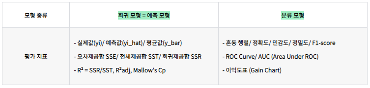
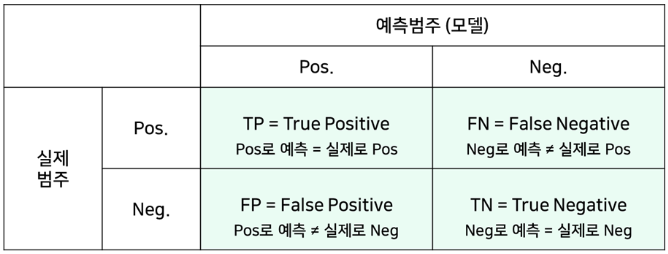
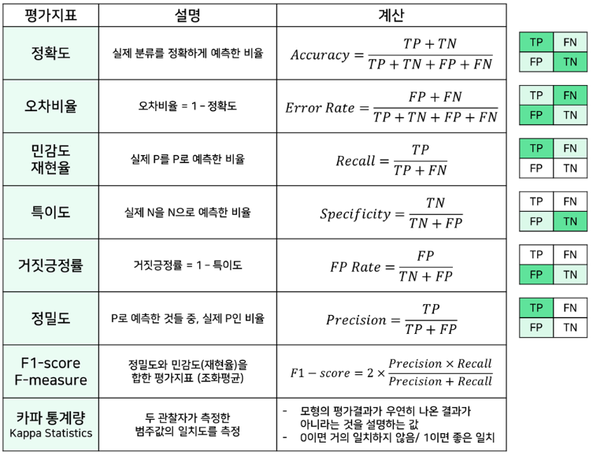
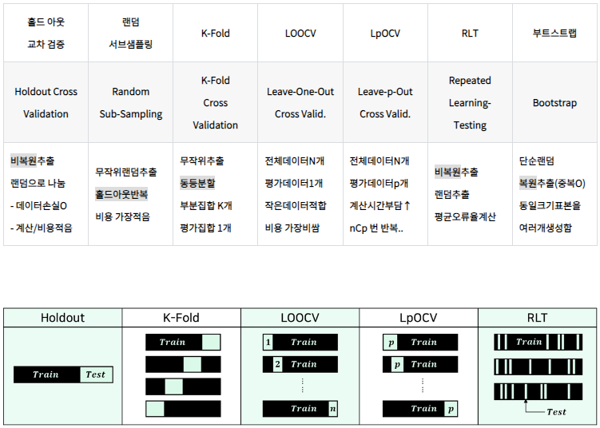
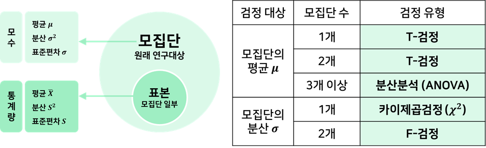
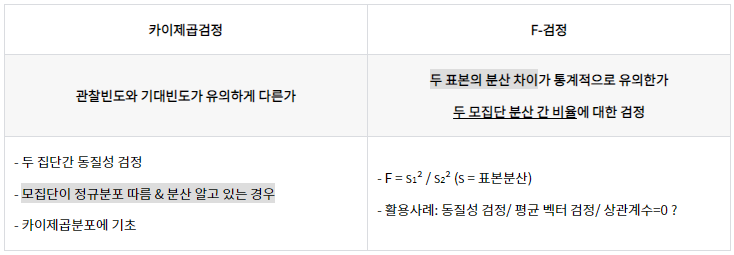
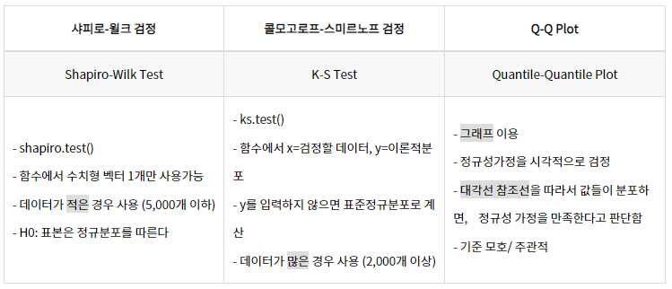
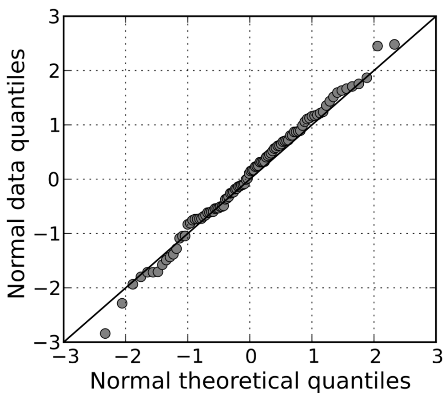
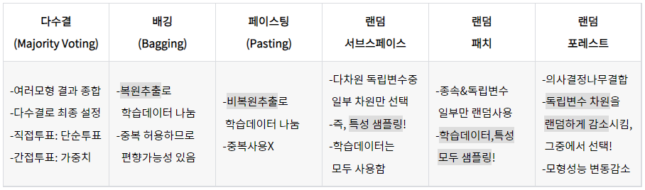

# IV. 빅데이터 결과 해석

## 01. 분석 모형 평가 및 개선
---
### 1.1 분석 모형 평가

|-|KeyWord|
|:--:|--|
|평가지표|회귀 모형 평가지표, SSE, SST, SSR, R²=결정계수, R²adj, Mallow's Cp, 분류 모형 평가지표, 혼동 행렬, ROC 곡선, AUC, 이익도표|
|분석 모형 진단|홀드 아웃 교차 검증, 다중 교차 검증, 정확도, 오차비율, 민감도, 특이도, 거짓긍정률, 정밀도, F1-score, 카파통계량|
|교차검증|홀드 아웃 교차 검증, 랜덤 서브샘플링, K-Fold Cross Validation, LOOCV, LpOCV, RLT, 부트스트랩|
|모수 유의성 검정|모집단평균, Z-검정, T-검정, 분산분석, 모집단분산, 카이제곱검정, F-검정|
|적합도 검정|적합도 검정,정규성 검정, 샤피로-윌크 검정, 콜모고로프-스미르노프 검정(K-S검정), Q-Q Plot|

<분석 모형 평가>
 - 모형의 유용성 판단/비교/평가 과정은 매우 중요
 - 모형을 만든 것으로 끝이 아님
   - 객관적인 평가지표를 통해 실무에서 사용 가능한지 평가
   - 기존 운영시스템과의 연계 / 통합을 통해 지속적인 개선
 - 분석 모형 평가란? -> 다음 사항들에 대해 분석하는 것
   - 구축된 모형이 임의의 모형보다 더 우수한 성과를 보이는가
   - 고려된 모형들 중 어느 것이 가장 우수한가
 - 분석 모형 평가 기준
   - 일반화의 가능성: 데이터 확장 적용이 가능한가 -> 모집단 내 다른 데이터에서도 결과가 안정적인지 평가
   - 효율성: 필요한 입력변수가 적을수록 효율적
   - 예측&분류 정확성

============================================================
#### 1) 평가지표

##### (1) 회귀 모형 평가지표
 - SSE / SST / SSR / R² = 결정계수 / R²adj / Mallow's Cp
 - 회귀 모형 평가 지표  

 - 회귀 모형 기본 평가지표
   - SSE(오차제곱합)/SST(전체제곱합)/SSR(회귀제곱합)/AE/MAE/RMSE/MAPE/MPE
   - SSE = 오차제곱합 = 예측값과 실젯값의 차이(오차) 제곱 합
   - SST = 전체제곱합 = 실젯값과 평균값의 차이 제곱 합
   - SSR = 회귀제곱합 = 예측값과 평균값의 차이 제곱 합
   - AE = Average Error = 평균 오차
   - MAE = Mean Absolute Error = 평균 절대 오차
   - RMSE = Root Mean Squared Error = 평균 제곱근 오차
   - MAPE = Mean Absolute Percentage Error = 평균 절대 백분율 오차
   - MPE = Mean Percentage Error = 평균 백분율 오차  
    
 - 회귀 모형 성능 검증지표
   - R²(결정계수) / R²adj(수정된 결정계수) / Mallow's Cp
   - 결정계수
     - 회귀모형이 실제값을 얼마나 잘 나타내는지에 대한 비율(0~1)
     - 독립변수 개수가 많은 모형의 경우 부적합
     - 단점: 모형의 변수 개수가 증가할 때, 그 변수가 유의하지 않더라도 결정계수는 증가
   - 수정된 결정계수
     - 결정계수의 단점을 보완함 -> 수정된 결정계수는 결정계수보다 항상 작음
     - 유의하지 않은 독립변수를 추가할수록, 패널티 부과 -> 감소
     - 모형이 유용한 독립변수를 추가할수록 증가
     - 따라서, 독립변수 개수가 많은 모형에 적합
   - Mallow's Cp
     - 적절하지 않은 독립변수 추가에 대한 패널티를 부과한 통계량
     - 값이 작을수록, 실제값을 잘 설명하는 모형임

##### (2) 분류 모형 평가지표
 - 혼동 행렬 / ROC 곡선 / AUC / 이익도표
 - 혼동 행렬(Confusion Matrix)(정오 행렬)  
 
 
   - 모델이 분류한 예측범주와 실제 분류범주를 교차표로 정리한 행렬(N⨉N)
   - 예측값과 실제값의 일치빈도를 통해 모델 정확도 평가
   - 모델 성능을 평가할 수 있는 평가지표 도출  
   -> 정확도/오차비율/민감도/특이도/거짓긍정렬/정밀도/F1-score/카파통계량  
   
   
 

 - ROC 곡선(ROC Curve)  
 

 - 이익 도표(Gain Chart)
   - 그래프를 통해 분류모형의 성능을 평가함(이익 도표 = 이익 곡선 = 리프트 곡선)
   - 이익(Gain)
     - 목표범주에 속한 개체들이 임의로 나눈 등급별로 얼마나 분포하고 있는지 나타내는 값

============================================================
#### 2) 분석 모형 진단
##### (1) 데이터 분석 모형의 오류
 - 일반화 오류 / 학습 오류
 - 일반화 오류(Generalization Error): 주어진 데이터의 특성을 지나치게 반영 -> 주변특성&단순잡음 묘사 -> 과대 적합
 - 학습 오류(Training Error): 주어진 데이터의 특성을 덜 반영하도록 모형 생성 -> 과소 적합

##### (2) 데이터 분석 모형 검증
 - 홀드 아웃 교차 검증 / 다중 교차 검증
 - 홀드 아웃 교차 검증
   - 데이터 집합 구분: 서로 겹치지 않는 학습집합, 시험집합으로 무작위 구분
   - 학습집합으로 분석모형을 구축
   - 시험집합으로 분석모형의 성능 평가
 - 다중 교차 검증
   - 데이터 집합 나눔: 같은 크기의 부분집합 k개로 무작위 나눔
   - k개 부분집합 = 1개는 시험집합 + (k-1)개는 학습집합
   - 종류: Random Sub-Sampling/K-Fold Cross Validation/Leave-One-Out Cross Validation/Bootstrap

##### (3) 분석 모형 시각화
 - 정보 구조화 -> 정보 시각화 -> 정보 시각표현
 - 시각화: 그래프/그림과 같은 시각적 도구를 통해 의사결정자에게 제공하여, 분석결과를 쉽게 이해할 수 있게 함
 - 정보 구조화: 데이터 수집 및 탐색/데이터 분류/데이터 배열/데이터 재배열
 - 정보 시각화: 시각/분포/관계/비교/공간 시각화
 - 정보 시각표현: 그래픽 7요소/그래픽디자인 기본원리/인터랙션(Interaction)/시각정보디자인 7원칙

##### (4) 분석 모형 진단
 - 기본 가정 진단 / 잔차의 산점도
 - 선정한 분석모형의 기본가정에 대한 진단이 필요
 - 회귀모형은 잔차의 산점도를 이용하여 모형 진단
 - 선형성 / 독립성 / 등분산성 / 정상성(정규성)
   - 선형성: 잔차의 산점도
   - 독립성: 잔차의 산점도 - 경향성 없이 일정한 분포인가?
   - 등분산성: 잔차의 산점도 - 전체적으로 고르게 흩어져있는가?
   - 정상성(정규성): 샤피로-윌크 검정 / 콜모고로프-스미르노프 검정 / Q-Q Plot

============================================================
#### 3) 교차 검증
##### (1) 교차 검증(Cross Validation)
 - 모델의 일반화 오차에 대해 신뢰할만한 추정치를 구하기 위하여 훈련&평가 데이터를 기반한 검증 기법
 - 홀드 아웃 교차 검증, 랜덤 서브샘플링, K-Fold Cross Validation, LOOCV, 부트스트랩

##### (2) 홀드 아웃 교차 검증(Holdout Cross Validation)
 - 비복원추출로 랜덤하게 학습/평가 데이터를 나누어 검증
 - 데이터를 나누는 방법에 따라 결과가 많이 달라짐(5:5, 3:7, 2:1)
   - 학습 데이터(Training set): 분류기 만들 때 사용
   - 검증 데이터(Validation set): 분류기들의 매개변수 최적화를 위해 사용
   - 평가 데이터(Test set): 최적화된 분류기 성능 평가를 위해 사용
 - 데이터 손실O : 평가 데이터는 학습에 사용할 수 없음
 - 계산량↓ 평가 쉬움↑

##### (3) 랜덤 서브샘플링(Random Sub-Sampling)
 - 모집단에서 표본을 무작위 추출
 - 홀드아웃 반복 -> 데이터 손실X
- 측정/평가 비용 가장 적음
 - 각 샘플들을 학습/평가에 얼마나 사용할지 횟수 제한X -> 특정 데이터만 학습할 수 있음

##### (4) K-Fold Cross Validation
 - 무작위/동일크기/K개 부분집합으로 나눔 -> 실험결과 K개를 종합
 - 데이터 분할
   - 전체 집합 = K 개
   - 학습 집합 = K-1 개
   - 평가 집합 = 1 개
 - 모든 데이터를 학습/평가에 사용 가능
 - K값에 따라 달라짐
   - K값 증가할수록, 계산량도 증가함
   - K = 10 이면, 데이터 10% 낭비됨
 - LOOCV 보다 측정/평가 비용 적음
 - 절차: 동등분할 -> 학습/평가데이터 구성 -> 분류기 학습 -> 분류기 성능확인
   - 학습/평가데이터 구성: (K-1)개 부분집합은 학습, 1개 부분집합은 평가에 쓰는 K개의 실험데이터 구성
   - 분류기 성능확인: 실험 결과 K개를 종합하여 분류기의 최종 성능을 확인

##### (5) LOOCV(Leave-One-Out Cross Validation)
 - 전체 데이터 N개 중 샘플 1개만 평가 / (N-1)개는 학습 -> N번 반복
 - 데이터 분할
   - 전체 데이터 = N 개
   - 학습 데이터 = N-1 개
   - 평가 데이터 = 1 개
 - 데이터 손실X
 - 계산량 많음 -> 측정/평가 비용 가장 비쌈
 - 작은 크기 데이터에 좋음
 - 방법은 K-Fold랑 같음 -> K-Fold는 부분집합 개수 K / LOOCV는 데이터 개수 N

##### (6) LpOCV(Leave-p-Out Cross Validation)
 - 전체 데이터 N개 중 샘플 p개만 평가 / (N-p)개는 학습 -> nCp번 반복
 - 데이터 분할
   - 전체 데이터 = N 개
   - 학습 데이터 = N-p 개
   - 평가 데이터 = p 개
 - 계산량/시간 부담 큼

##### (7) RLT(Repeated Learning-Testing)
 - 랜덤 비복원추출
 - 절차: 데이터 분리 -> 훈련 -> 에러 계산 -> 반복 -> 평균오류율 계산
   - 데이터 분리: 랜덤하게 학습/검증 데이터 분리
   - 데이터 훈련: 학습 데이터로만 훈련
   - 에러 계산: 검증 데이터로 Error 계산
   - 반복: 데이터 훈련과 에러 계산을 2회 더 반복
   - 평균 오류율 E = ∑E / N

##### (8) 부트스트랩(Bootstrap)
 - 단순랜덤 복원추출 -> 동일크기 표본 여러개 샘플링
 - 랜덤 복원추출 -> 중복 허용 -> 특정 샘플이 학습 데이터에 포함될 확률 = 약 63.2%
 - 학습 데이터에 한번도 포함되지 않는 데이터 발생 -> 평가에 사용함 = 약 36.8%

============================================================
#### 4) 모수 유의성 검정
<가설검정 유형>

##### (1) 모집단과 모수 관계
 - 모집단(Population): 분석/관심 대상 전체 그룹
 - 모수(Parameter): 모집단을 설명하는 어떤 값/ 모집단의 특성을 나타내는 값
 - 표본(Sample): 모집단 일부/ 모집단 분석을 위해 추출한 한 집단의 관측치
 - 통계량(Statistic): 모집단을 설명하는 어떤 값을 표본으로부터 구한 값/표본의 특성을 나타내는 값

##### (2) 모집단 평균에 대한 유의성 검정
 - Z-검정 / T-검정 / 분산분석

 - T-분포: 표준정규분포와 유사
   - 0 중심 좌우대칭 but 꼬리가 더 길고 평평함
   - 정규분포의 평균을 측정할 때 많이 사용하는 분포
   - 적은 표본으로 모집단 평균을 추정하기 위해, 정규분포 대신 사용하는 확률분포
   - 자유도(= 표본개수-1) 증가할수록, 표준정규분포에 가까워짐
   - 중심극한정리: 표본개수가 충분히 크다면/자유도가 30이 넘으면, 정규분포에 가까워짐

##### (3) 모집단 분산에 대한 유의성 검정
 - 카이제곱검정 / F-검정

 - 카이제곱분포:  χ = Z₁² + Z₂² + Z₃² + ... + Zn²
   - 각각 독립인 표준정규분포를 취하는 확률변수 Z의 제곱의 합인 χ 를 따르는 확률 분포
   - 자유도 n 이 작을수록, 왼쪽으로 치우침
   - 자유도 n이 클수록, 정규분포에 가까워짐

============================================================
#### 5) 적합도 검정
##### (1) 적합도 검정
 - 표본집단 분포가 특정이론을 따르고 있는지 검정
 - 기법 유형: 가정된 확률이 정해진 경우 & 아닌경우
   - 가정된 확률 검정: 카이제곱검정
   - 가정된 확률 없음 -> 정규성 검정: 샤피로-윌크 검정/콜모고로프-스미르노프 검정/Q-Q Plot

##### (2) 적합도 검정 기법
 - chisq.test() -> p-value>0.05 -> 관측된 데이터가 가정된 확률을 따르
 - 정규성 검정: 정규성 가정을 만족하지 못한다면, 모형 타당성이 떨어지고 신뢰성을 의심받을 수 있음 -> 검정 필요

 - Q-Q Plot  

---
### 1.2 분석 모형 개선

|-|KeyWord|
|:--:|--|
|과대적합방지|데이터증강, 모델복잡도감소, 가중치규제, L1규제, L2규제, 드롭아웃|
|매개변수 최적화|확률적 경사 하강법, 모멘텀, AdaGrad, Adam|
|분석 모형 융합|취합방법론, 다수결, 배깅, 페이스팅, 랜덤서브스페이스, 랜덤패치, 랜덤포레스트, 부스팅방법론, 에이다부스트, 그래디언트부스트|

============================================================
#### 1) 과대 적합 방지
##### (1) 과대 적합(Over-fitting)
 - 지나친 학습 -> 일반화↓
 - 제한된 학습데이터셋에 지나치게 특화되어 새로운 데이터에 대한 오차가 매우 커지는 현상
 - 과대 적합이 발생하는 경우: 모델 파라미터 개수 많음 / 학습데이터셋 부족
 - 일반화(Generalization): 테스트데이터에 대해 높은 성능을 갖춤/정상추정함/과소&과대적합X
   - 과소 적합: 지나치게 단순한 모델/데이터에 내재된 구조를 학습하지 못함
   - 과대 적합: 지나치게 학습데이터에 적합/ 일반화 떨어짐

##### (2) 과대 적합 방지
 - 데이터 증강 / 모델 복잡도 감소 / 가중치 규제 / 드롭아웃
 - 데이터 증강(Data Augmentation)
   - 데이터 양이 적을 경우, 데이터를 변형하여 양을 늘림 
 - 모델 복잡도 감소
   - 은닉층 개수 감소 / 모델 수용력 낮춤 -> 모델 복잡도 줄일 수 있음
 - 가중치 규제 적용
   - 개별 가중치 값을 제한 -> 복잡한 모델을 간단하게
   - 비용함수(Cost Function): 관측값과 연산값의 차이를 도출  
   -> 비용함수 최소화를 위해서, 가중치들이 작아져야 함
   - λ = 규제 강도를 정하는 하이퍼 파라미터  
   ->  λ 값이 크면, 가중치 규제를 위해 추가한 항들을 작게 유지하는 것을 우선함
   - L1 규제: 모든 가중치들의 절댓값 합계를 비용함수에 추가 -> λ|w|
   - L2 규제: 모든 가중치들의 제곱합을 비용함수에 추가 -> (1/2)λw²
 - 드롭아웃(Dropout)
   - 학습 과정에서 신경망 일부를 사용하지 않음
   - 특정 뉴런/조합에 너무 의존적인 인공신경망이 되는 것을 방지
   - 매번 랜덤으로 뉴런 선택 -> 서로 다른 신경망들을 앙상블하는 것과 같은 효과
   - 신경망 학습 과정에서만 사용하는 기법
   - 예측 과정에서는 드롭아웃을 사용하지 않음
   - 드롭아웃 유형: 초기(DNN) / 공간적(CNN) / 시간적(RNN) 드롭아웃
     - 초기 드롭아웃: DNN 에서 사용
       - p의 확률로 노드들을 생략하여 학습함
       - 일반적으로 p = 0.5
     - 공간적 드롭아웃: CNN 에서 사용
       - 피처맵 내 노드 전체에 대해 드롭아웃 적용 여부를 결정함 
     - 시간적 드롭아웃: RNN 에서 사용
       - 노드가 아닌, 연결선 일부를 생략하여 학습함(Drop Connection)

============================================================
#### 2) 매개변수 최적화
##### (1) 매개변수(Parameter)
 - 데이터 학습을 통해, 모델 내부에서 결정되는 변수

##### (2) 매개변수 최적화(Parameter Optimization)
 - 손실함수(Loss Function): 학습모델의 출력값과 레이블 실제값의 차이(오차)
 - 모델 학습의 목적 = 매개변수 최적화
   - 손실함수의 값을 최소화하는 매개변수를 찾는 것
   - 오차를 최소화하는 가중치와 편향을 찾는 것

##### (3) 매개변수 종류: 가중치 & 편향
 - 가중치(Weight): "곱"
   - 입력값마다 각기 다르게 곱해지는 수치
   - y = ax+b 에서 기울기 a 해당
 - 편향(Bias): "합"
   - 가중합에 더해주는 상수
   - y = ax+b 에서 절편 b 에 해당

##### (4) 매개변수 최적화 기법
 - 확률적 경사 하강법 / 모멘텀 / AdaGrad / Adam
 - 2차원 손실함수 그래프를 이용하여 매개변수 최적화를 수행
   - X축 = 가중치(Wi)
   - Y축 = 손실값(=오차)
   - 그래프에서 기울기가 0인 지점(= 손실값이 최소화되는 지점)에서 최적의 매개변수를 찾을 수 있음
 - 매개변수 최적화 과정은 학습률에 따라서 달라짐
   - 학습률 적음 -> 매우 느린 학습 -> 최적화에 많은 시간 소요
   - 학습률 높음 -> 기울기=0 지점을 지나침 -> 최적화 실패
   - 학습률 적당 -> 기울기=0 지점 찾음 -> 최적화 성공

 - 확률적 경사 하강법(SGD): 기울기를 구할 때 1개의 데이터를 무작위로 선택함(확률적)
   - 문제점: 지역극소점에 갇히는 문제 자주 발생
     - 손실함수 그래프에서 지역극소점(Local)에 갇혀서, 전역극소점(Global)을 찾지 못하는 경우가 많음
     - 손실함수가 방향에 따라 기울기가 달라지는 비등방성 함수일 경우 매우 비효율적
   - SGD의 단점 개선을 위해 고안된 방법론들이 모멘텀/AdaGrad/Adam
   - 탐색경로: 지그재그로 크게 변함  
 - 모멘텀(Momentum): SGD + 속도
   - 기울기가 줄어도 누적된 기울기 값에 의해 탐색경로의 변위가 줄어들어서 빠르게 최적점으로 수렴
   - X축의 한 방향으로 일정한 가속 / Y축 방향 속도는 일정하지 않음
   - 관성의 방향을 고려하여, 진동과 폭을 줄이는 효과
   - 모멘텀 갱신경로: 공이 그릇 바닥을 구르듯 움직임 -> SGD보다 지그재그 덜함  
 - AdaGrad(Adaptive Gradient Algorithm): 학습 진행할수록 학습률 감소시킴
   - 학습률 감소 기법 적용
     - 손실함수 처음 부분: 기울기 큼 -> 학습률 큼
     - 최적점에 가까워짐: 기울기 감소 -> 학습률 줄여서 조금씩 작게 학습
   - 최적점 탐색경로
     - 손실함수 처음 부분: y축 방향으로 기울기 큼 -> 큰 폭으로 움직임
     - 최적점에 가까워짐: y축 방향으로 갱신 강도 빠르게 감소 -> 큰 폭으로 작아짐
   - 각각의 매개변수에 맞는 학습률 값을 만들어줌
   - 탐색경로: 지그재그 움직임이 빠르게 줄어듦  
 - Adam(Adaptive Moment Estimation): 모멘텀 + AdaGrad
   - Adam 갱신경로
     - 모멘텀처럼 공이 그릇 바닥을 구르듯 움직임
     - 모멘텀보다 좌우 흔들림 적음

============================================================
#### 3) 분석 모형 융함
##### (1) 취합 방법론(Aggregation)
 - 다수결/배깅/페이스팅/랜덤 서브스페이스/랜덤 패치/랜덤 포레스트

##### (2) 부스팅 방법론(Boosting)
 - 에이다 / 그래디언트 부스트
 - 에이다 부스트(AdaBoost) = 적응 부스트(Adaptive Boost)
   - 약한 모형 각각을 순차적으로 적용하는 과정에서 잘 분류된 샘플 가중치 낮추고 오분류된 샘플 가중치 높여서 샘플 분포를 변화시키는 기법
 - 그레디언트 부스트(Gradient Boost)
   - 약한 모형 각각을 순차적으로 적용하는 과정에서 오분류된 샘플 에러를 최적화하는 기법

============================================================
#### 4) 최종 모형 선정
##### (1) 최종 모형 선정 절차
 - 최종 모형 평가 기준 선정 -> 최종 모형 분석 결과 검토 -> 알고리즘별로 결과 비교
 - 평가 기준 선정: 정확도 / 재현율 / 정밀도 등의 평가지표 이용
 - 분석 결과 검토: 평가 기준, 실질적인 활용 가능성에 대한 검토
 - 알고리즘별 결과 비교: 알고리즘별로 파라미터를 변경하며 수행 -> 변경 전후의 차이점 비교, 결과 기록
