# IV. 빅데이터 결과 해석

## 02. 분석 결과 해석 및 활용
---
### 2.1 분석 결과 해석

|-|KeyWord|
|:--:|--|
|분석 모형 해석|데이터시각화, 시간시각화, 분포시각화, 관계시각화, 비교시각화, 공간시각화, 시각화도구, 태블로, 인포그램, 차트블록, 데이터래퍼|
|비즈니스기여도평가|총소유비용(TCO), 투자대비효과(ROI), 순현재가치(NPV), 내부수익률(IRR), 투자회수기간(PP)|

============================================================
#### 1) 분석 모형 해석
##### (1) 데이터 시각화(Data Visualization)
 - 데이터에 대한 이해를 돕기위해 그림/도형과 같은 그래픽 요소들을 이용하여 데이터를 묘사/표현하는 과정
 - 데이터 시각화 방법
   - 선/막대/원 등의 기하나 도형과 같은 양식을 이용하여 데이터 특징을 설명할 수 있는 모양으로 만들거나 색상/레이블 등의 특성을 활용하여 데이터를 표현
 - 데이터 시각화 기능 구분: 설명 / 탐색 / 표현 기능
   - 설명 기능: 전달하려는 메세지, 주요한 분석결과를 설명 -> 사용자에게 명확하게 보여줘야 함
   - 탐색 기능: 데이터에 숨겨진 관계와 패턴을 찾기 위함 -> 사용자가 직접 탐색함
   - 표현 기능: 이야기 전달과 공감을 불러일으키기 위함 -> 예술적 표현, 작품
 - 데이터 시각화의 목적
   - 사용자가 주제에 대해 더 잘 이해하고 느끼게 하는 것
   - 정보 전달: 전달 & 분석 -> 실용적 & 과학적인 측면
   - 설득: 공감 & 설득 -> 추상적 & 예술적인 측면
 - 데이터 시각화 절차: 구조화 -> 시각화 -> 시각표현
   - 구조화: 목표 설정/데이터 표현 규칙&패턴 탐색/시각화 요건정의/시나리오&스토리 구성
   - 시각화: 시각화 도구&기술 선택/시각화 구현
   - 시각표현: 그래프 보정&품질향상/전달요소 강조/인터랙션 기능 적용/결과물 검증

##### (2) 데이터 시각화 유형
 - 시간 / 분포 / 관계 / 비교 / 공간 시각화

##### (3) 시각화 분석을 위한 데이터 유형
 - 범주 및 비율 / 추세 및 패턴 / 관계 및 연결
 - 범주 및 비율: 범위 / 분포 / 순위 / 측정
 - 추세 및 패턴: 추세 방향 / 추세 패턴 / 추세 속도 / 변동 패턴 / 중요도 / 교차
 - 관계 및 연결: 예외 / 상관성 / 연관성 / 계층 관계

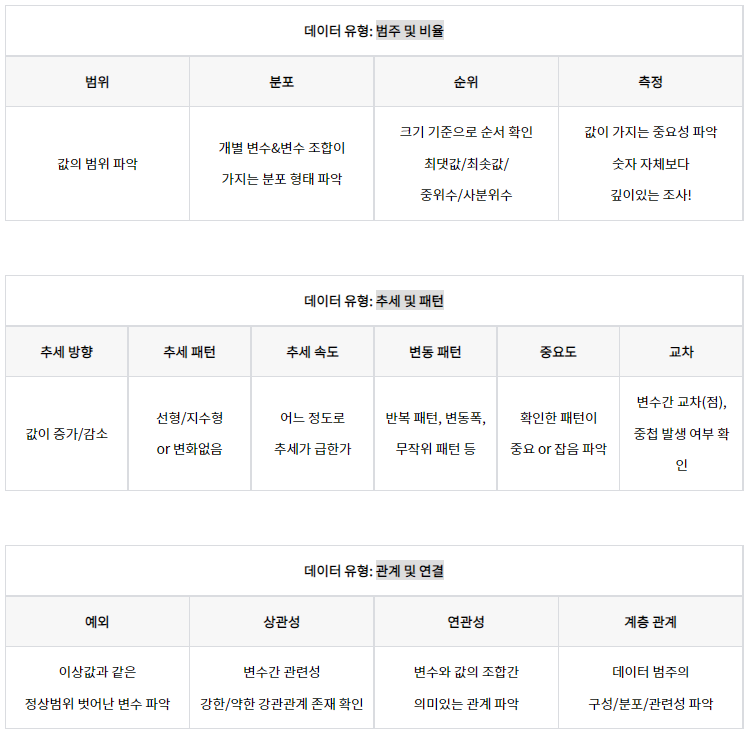

##### (4) 빅데이터 시각화 도구
 - 태블로 / 인포그램 / 차트블록 / 데이터래퍼
 - 태블로(Tableau): 데이터를 클라우드에 저장 -> 차트/그래프/지도 등의 다양한 그래픽 기능 제공
 - 인포그램(Infogram): 실시간으로 인포그래픽을 연동해줌
 - 차트 블록(Chart Blocks): 코딩없이 데이터베이스 형태의 데이터를 쉽게 시각화 -> 웹기반 차트 구현
 - 데이터 래퍼(Data Wrapper): 사용자 목적에 따라 제작할 수 있는 레이아웃 제공 -> 차트/맵으로 데이터를 변환

============================================================
#### 2) 비즈니스 기여도 평가
##### (1) 비즈니스 기여도 평가
 - 사업수행에 영향을 주는 요소를 수치화된 자료형태로 산출하는 평가방법
 - 비즈니스 기여도 평가지표: 총소유비용/투자대비효과/순현재가치/내부수익률/투자회수기간

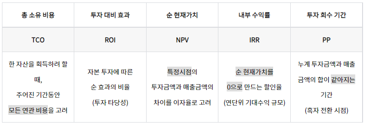

 - 고려사항: 효과 / 성능 / 중복 / 최적화 검증
   - 효과 검증: 검출률 증가 / 향상도 개선 등의 효과 제시
   - 성능 검증: 시뮬레이션을 통한 처리량 / 대기시간 / 대기행렬 감소
   - 중복 검증: 타 모델링과의 중복에 따른 효과를 통제 / 제시할 수 있어야 함
   - 최적화 검증: 최적화를 통해 목적함수가 증가한 만큼의 효과 제시

---
### 2.2 분석 결과 시각화

|-|KeyWord|
|:--:|--|
|시공간 시각화|시간시각화, 막대그래프, 누적 막대그래프, 선그래프, 영역차트, 계단식그래프, 공간시각화, 등치지역도, 등치선도, 도트맵, 도트플롯맵, 버블맵, 버블플롯맵, 카토그램|
|관계 시각화|산점도, 산점도 행렬, 버블차트, 히스토그램|
|비교 시각화|플로팅바차트, 히트맵, 체르노프페이스, 스타차트, 평행좌표그래프|
|인포그래픽|인포그래픽|

============================================================
#### 1) 시공간 시각화
##### (1) 시간 시각화
 - 시간에 따른 데이터 변화를 표현
 - 주요 관심요소: 경향성/트렌드/추세
 - 시간 시각화 유형: 막대그래프/누적 막대그래프/선그래프/영역차트/계단식그래프

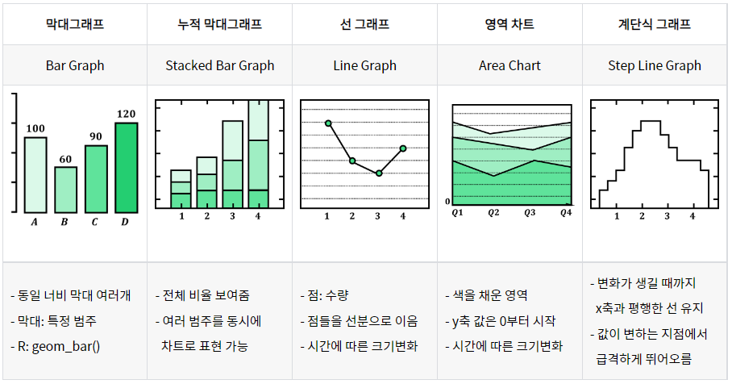

##### (2) 공간 시각화
 - 지도 상에 해당하는 정보를 표현
 - 대부분 위도&경도 사용함
 - R에서 정적/동적인 방법으로 시각화 가능
   - 정적 공간 시각화 패키지: maps, mapproj, maptools, mapplots
   - 동적 공간 시각화 패키지: RgoogleMaps, ggmap
 - 공간 시각화 유형: 등치지역도/등치선도/도트맵/도트플롯맵/버블맵/버블플롯맵/카토그램

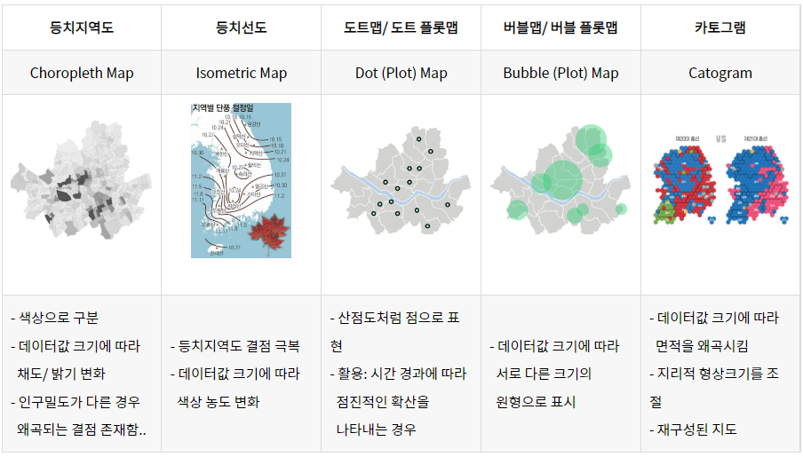

============================================================
#### 2) 관계 시각화
##### (1) 관계 시각화
 - 다변량 데이터 사이에 존재하는 변수간 연관성/분포/패턴을 찾는 시각화 방법
 - 상관관계를 시각화하는 기법
   - 한 가지 요소의 변화가 다른 요소의 변화와 관련이 있는지 표현하는 시각화 방법
 - 관계 시각화 유형: 산점도/산점도 행렬/버블차트/히스토그램

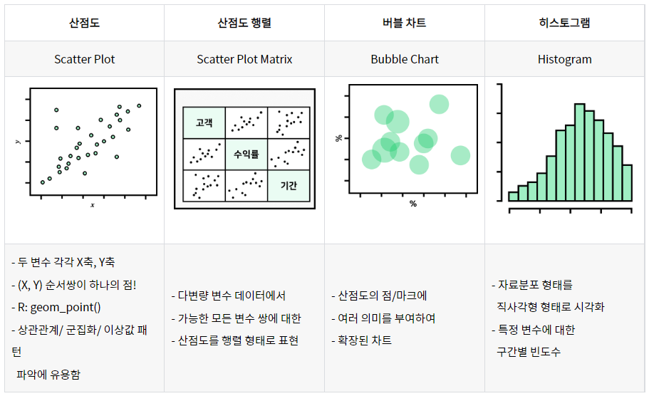

============================================================
#### 3) 비교 시각화
##### (1) 비교 시각화
 - 다변량 변수 데이터를 제한된 2차원에 효과적으로 표현
 - 비교 시각화 유형: 플로팅바차트/히트맵/체르노프페이스/스타차트/평행좌표그래프

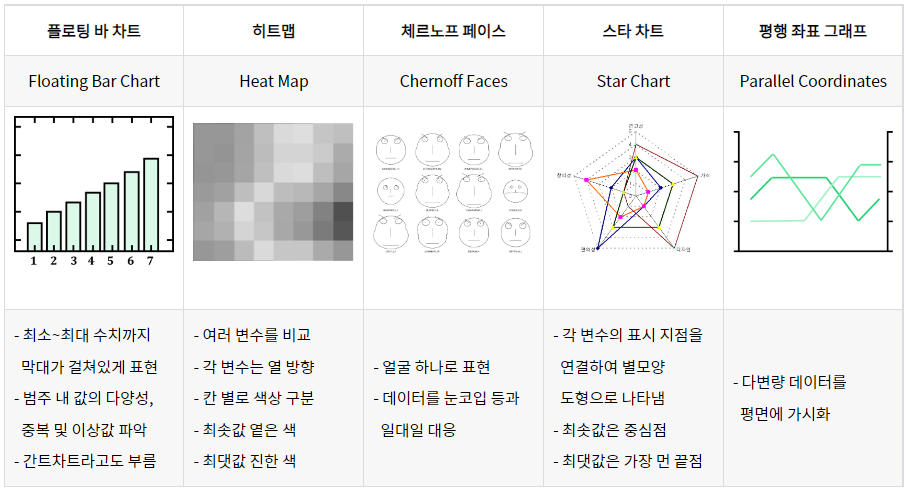

============================================================
#### 4) 인포그래픽
##### (1) 인포그래픽(Infographics)
 - 중요 정보를 하나의 그래픽으로 표현함
 - 복잡하고 어려운 정보/데이터를 쉽고 명확하게 이해할 수 있게 함
 - 그래픽과 텍스트가 균형을 이루도록 조합
 - 인포그래픽 유형: 지도형/도표형/스토리텔링형/타임라인형/비교분석형/만화형
 - 활용방법: 퍼블릭 데이터 활용/템플릿과 아이콘 배치/무료 툴 활용/저작권 설정/인포그래픽스 홍보

---
### 2.3 분석 결과 활용

|-|KeyWord|
|:--:|--|
|분석 모형 전개|분석모형전개, 운영시스템적용, 운영및개선방안, 예측오차, 추적신호|
|분석 결과 활용 시나리오 개발|활용분야분류, 초기아이디어개발관점, 마인드맵방식, 친화도표방식, 피라미드방식, 가치사슬관점, 서비스모형, 채널시스템활용, 비즈니스모형활용, 비즈니스모델캔버스|
|분석 모형 모니터링|성능모니터링, 모니터링솔루션, 샤이니(R), 분석주기, 성능이벤트, 임계치|
|분석 모형 리모델링|리모델링|

============================================================
#### 1) 분석 모형 전개
##### (1) 빅데이터 모형 운영 시스템 적용방안
 - 모형개발&운영 -> 적용방안 -> 적용단계
 - 빅데이터 모형 개발 및 운영:  
 분석목적 정의 -> 가설검토 -> 데이터 준비&처리 -> 모델링 및 분석 -> 정확도&성능평가 -> 운영

|분석목적 정의|가설검토|데이터 준비&처리|모델링 및 분석|정확도&성능 평가|운영|
|--|--|--|--|--|--|
|-문제가 무엇인지  방식/목적을 명확히|-문제해결에 적합한  가설수립 -통계적으로 유의미한  결론의 활용 검토|-전처리: 변수정의,  일관성점검,정제 등 -변수변환/파생변수 -데이터 분할|-검토된 사안을  통계적 질문으로 변환 -학습데이터셋으로  분석모형 도출|-검증데이터셋으로  분석모형을 평가|-분석모형을 운영시스템과  통합/활용|

 - 빅데이터 모형의 운영 시스템 적용방안
   - 도출된 모형을 의사결정에 활용하기 위해서 운영 시스템과의 통합이 필요함
   - 운영 시스템과 모형에 사용된 언어가 같은 경우 -> 통합과정 쉬움
   - 통계 패키지로 모형이 개발된 경우 -> 대부분의 경우, 통합과정 어려움 -> 호환을 위해 인터페이스 필요
     - 인터페이스를 통해 모듈 구동 -> 결과값 도출 -> 인터페이스로 직접 전달 or 파일/DBMS로 간접 전달
     - 인터페이스: 서로 다른 2개의 시스템/장치간 정보/신호를 주고 받는 경우의 접점이나 시스템
 - 빅데이터 모형의 운영 시스템 적용단계
   - 분석 모형 적용 모듈 결정 -> 통합방식 결정 및 구현

##### (2) 빅데이터 모형의 운영 및 개선방안 수립
 - 예측 오차 계산 -> 예측모형의 점검 여부 결정 -> 개선 방향 결정
 - 개선방안 수립
   - 모형을 운영 시스템에 적용 -> 시간이 지남에 따라 성능저하 발생할 수 있음 -> 지속적인 성능추적이 필요함
   - 예측모형에 대한 성능추적: 추적 신호 값을 활용하여, 예측 오차가 계속 증가 or 감소하는지 확인 필요
 - 추적 신호(TS; Tracking Signal) = (예측 오차들의 합)/(예측 오차 절댓값들의 평균)
 - 모형 개선방안 수립 절차  
 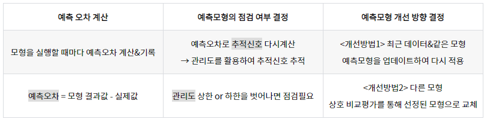

============================================================
#### 2) 분석 결과 활용 시나리오 개발
##### (1) 분석 결과에 따른 활용 분야 분류
 - 분석 결과를 활용할 수 있는 분야 파악
   - 직접(1차) / 파생(2차) 활용할 수 있는 업무와 가치사슬 파악
   - 직접 활용: 해당 업무의 가치사슬에서 직접 활용 -> 활용방안이 정의되어 있음
   - 파생 활용: 활용방안 확대 or 유사/관련있는 업무의 가치사슬에서 분야 파악
 - 분석 결과를 활용할 수 있는 분야 분류
   - 초기 아이디어 개발/가치 사슬 관점 -> 관련있는 아이디어를 그룹화하여 분류
   - 초기 아이디어 개발 관점의 분류
     - 마인드맵/친화도표/피라미드 방식의 분류
     - 마인드맵: 줄거리를 이해하며 정리
     - 친화도표: 관련있는 아이디어끼리 묶음
     - 피라미드: 계층 구조가 중요한 경우에 적용
   - 가치 사슬 관점의 분류
     - 수평적/수직적으로 통합/확대하여 새로운 가치사슬을 발견
     - 가치사슬: 기업에서 경쟁전략을 세우기 위해, 자신의 경쟁적 지위를 파악하고 이를 향상시킬 수 있는 지점을 찾기 위해 사용하는 모형

##### (2) 분류 결과를 토대로 적용 가능한 서비스 영역 도출
 - 직접 활용 / 파급 활용(융합 활용)
 
##### (3) 분류 결과를 토대로 적합한 신규 서비스 모형 도출
 - 새로운 서비스 모형을 위해 필요한 작업
   - 모형에 대한 개념 도출 -> 신규 서비스 모형 정의
 - 신규 서비스에 대한 사용자와 제공가치 도출
   - 초기 아이디어 개발/서비스 품질/일반적인/시장 전체 관점
   - 개념 도출을 위해서, 사용자와 제공가치를 찾는 것이 가장 중요함

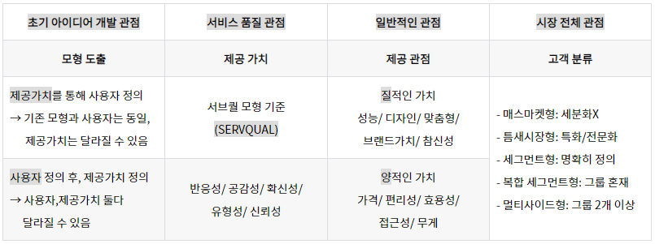

 - 신규 서비스 모형 정의: 개념도 / ITO 프로세스 관점
   - 서비스 개념도(청사진) 관점
     - 서비스 명칭/개념설명/사용자/제공가치/주요기능 등에 대해 정의서 작성
   - ITO 프로세스 관점
     - 개념도 관점보다 구체적으로 접근 가능(ex. 시스템/투입요소/변환과정/산출 등)

##### (4) 서비스 모형에 따른 활용 방안 제시
 - 채널 시스템 / 비즈니스 모형 활용 방안
 - 조직 내부에서 빅데이터 서비스 제공을 위한 채널 시스템 활용 방안 수립
   - 사용자에게 서비스를 제공하는 채널 시스템을 정의함
   - 기존 시스템에 새롭게 기능 추가 or 신규 시스템 개발
 - 사업화를 추진하기 위한 비즈니스 모형 활용 방안 수립
   - 수익 창출에 활용할 수 있는 비즈니스 모형
   - "서비스 모형의 사용자"와 "비즈니스 모형의 사용자"가 동일한지 파악
   - 신규 빅데이터 비즈니스 모형 정의
     - 최초 도입 or 기존 모형을 확장
     - 최초 도입인 경우: 핵심 성공 요인, 주요 실패 요인을 파악해야 함
   - 신규 빅데이터 비즈니스 모형 사례: "비즈니스 모델 캔버스"

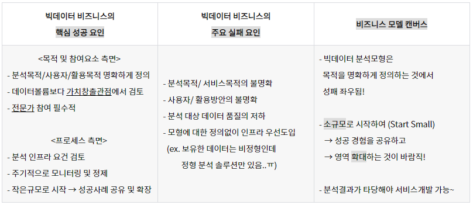

============================================================
#### 3) 분석 모형 모니터링
##### (1) 분석 모형 모니터링
 - 실시간/배치(일괄) 스케줄러 실행 -> 주기별로 자동 모니터링 -> 이상 시에만 확인
 - 분석 모형의 성과가 예상했던 수준으로 나오고 있는지 모니터링
 - 모니터링 솔루션: 자체 상태/정상 작동상태 유무/데이터 처리 및 분석 소요시간/모델에 따른 처리성능 관점에서 모니터링 수행
 - R Shiny(샤이니)
   - 모델링 결과를 간단히 배포 가능
   - 구성: 사용자 작업 파일(ui.R) / 서버 파일(server.R)
   - 해당 URL에 접속하면, R로 개발한 분석 모델 실행 가능

##### (2) 분석 모형 성능 모니터링
 - 분석 주기/응용 프로그램/응용 플랫폼/응용 솔루션/성능 이벤트/임계치
 - 성능 모니터링: 측정 항목 정의 -> 모니터링 실시 -> 측정 항목별 임계치/이벤트 등급별 알람 -> 성능 관리
 - 분석 주기별 모니터링 기준
   - 일간/주간/월간/분기/연간
   - 월간/분기: 성능 추이 집계 분석/현황 보고 등
   - 연간: 연간 업무 계획/연간 리포트 등
 - 측정 항목별로 영향을 미치는 요소 -> 응답시간/사용률/가용성/정확성

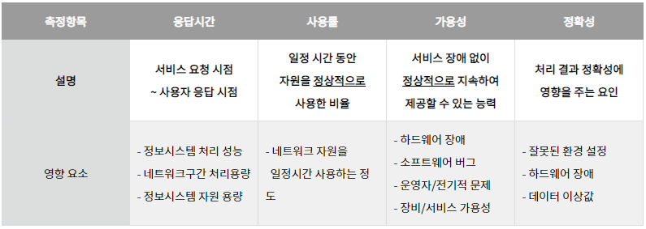

 - 주요 성능 측정 항목
   - 응용 프로그램 성능 측정 항목: 응답시간/트랜잭션 처리량/메모리 사용/데이터베이스 처리/오류 및 예외/배치 실행 환경
   - 응용 플랫폼 성능 측정 항목: 응답시간/트랜잭션 처리량/대기 큐/대기 시간/프로세스(스레드) 상태 및 개수/세션 상태 및 개수/통신 큐&채널 상태/자원 풀/오류 및 예외/부하 분산
   - 응용 솔루션 성능 측정 항목: 구간별 수행시간/대기 큐/메모리&버퍼/오류 및 예외
 - 성능 모니터링 이벤트 유형
   - 성능 이벤트: 설정한 임계치가 초과되는 것
   - 임계치(Threshold)
     - 성능 모니터링을 위해 정의해놓은 측정 항목마다 임계치를 설정함
     - 성능 모니터링 시, 장애 상황 및 성능 상태의 경계선
     - 임계치에 따른 등급 설정 -> 정상 상태를 기준치로 설정
     - 비정상적인 상황을 판단하는 경계
   - 임계치 설정 및 관리
     - 각 구성요소의 특성에 따라 별도로 임계치 설정
     - 임계치 설정: 제공하는 서비스 형태&시스템 특성 고려 -> 사용자 응답시간&처리속도&만족도 등을 반영
     - 임계치 관리: 단일기준X -> 다양한 요소를 반영하여 조정 -> 운영하면서 주변 요소의 영향을 받아 조정
   - 주요 성능 저하 요인: 서버 자원 부족/성능 조정 부족/ I/O 조각화 현상/데이터 이동/프로그래밍 오류/데이터베이스 설계 오류/악성코드/버그/하드웨어 다운/외부적 요인 등

##### (4) 분석 모형 모니터링 고려사항
 - 실제 운영시스템에 적용 -> 상용/오픈소스 도구 활용 or 자체개발 -> 데이터크기&처리속도 고려하여 적용
 - 상용/오픈소스 도구에서 기능을 제공할 때만, 자동화 적용 -> 모델 적용 및 갱신 자동화
 - 기법에 따른 고려사항
   - 시뮬레이션: 모델적용을 위한 프로세스&업무규칙이 문서화되고 공유됨
   - 최적화: 결과를 시스템과 인터페이스 가능하도록 데이터베이스 연동 프로그램을 개발

============================================================
#### 4) 분석 모형 리모델링
##### (1) 분석 모형 리모델링
 - 리모델링
   - 빅데이터 모형의 지속적인 성과 모니터링을 통해 편차가 일정수준 이상으로 지속적으로 하락하는 경우에 기존 모형에 데이터마이닝/시뮬레이션/최적화를 적용하는 개조작업
 - 리모델링 수행주기: 분기/반기/연 단위가 바람직함(일/주 단위는 특수분야만)
 - 리모델링 업무 및 주기  
 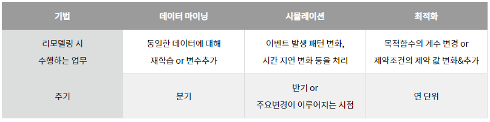

##### (2) 분석 모형 리모델링 절차 
 - 개선용 데이터 수집&처리 -> 분석 모델 개선 -> 분석 결과 평가&분석 모델 등록
 - 개선용 데이터 수집 및 처리: 기존 모델 성능 검토/개선 데이터 선정
 - 분석 모델 개선: 분석 알고리즘 선정/알고리즘 수행 및 분석결과 기록

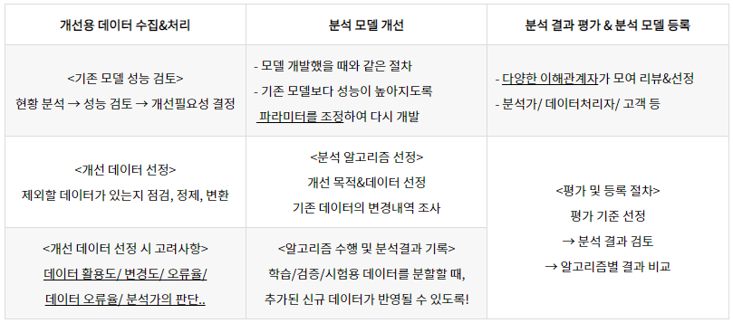

##### (3) 분석 모형 리모델링 고려사항
 - 정기적인 재평가와 모형 재조정(필요한 경우)이 필요함
 - 모형 재조정 주기 설정
   - 초기에 자주 수행(주기 짧게) -> 점진적으로 주기를 길게 설정(업무 특성에 따라 차이 있음)
 - 업무 자동화: 관리해야하는 모델이 월 20개 이상 or 다른 업무와 함께 수행해야 하는 경우에 권고됨
 - 리모델링 고려사항
   - 데이터 마이닝: 최신 데이터 적용/변수 추가
   - 시뮬레이션: 업무 프로세스 KPI 변경/주요 시스템 원칙 변경/발생 이벤트 건수 증가에 따른 성능평가와 재조정
   - 최적화: 조건 변화/가중치 변화/계수값 조정/제약조건 추가
